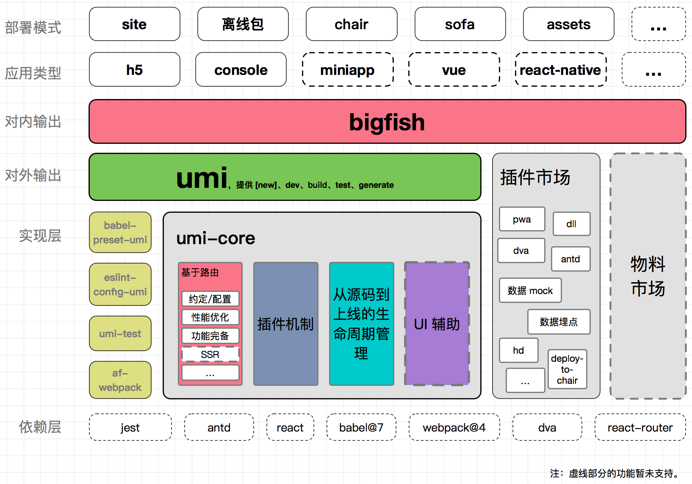
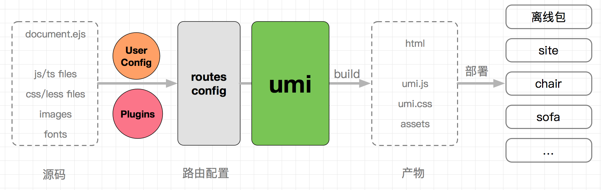

# 指南

## 介绍

umi（乌米），是一个可插拔的企业级 react 应用框架。umi 以路由为基础的，支持类 next.js 的约定式路由，以及各种进阶的路由功能，并以此进行功能的扩展，比如支持路由级的按需加载。[详情](https://umijs.org/zh/)

### 特性
* 开箱即用，内置 react，react-router 等
* 类 next.js 且功能完备的路由约定，同时支持配置的路由方式
* 完善的插件体系，覆盖从源码到构建产物的每个生命周期
* 高性能，通过插件支持 PWA、以路由为单元的 code splitting 等
* 支持静态页面导出，配置各种环境，比如中台业务、无线业务、egg等
* 开发启动快，支持一键开启dll等
* 兼容I9，基于 umi-plugin-polyfills
* 完善的 TypeScript 支持，包括 d.ts 定义和 umi test
* 与dva数据流的深入融合，支持 duck directory、model 的自动加载、code splitting等等

### 框架

下图是 umi 的架构图。



### 从源码到上线的生命周期管理

市面上的框架基本都是从源码到构建产物，很少会考虑到各种发布流程，而 umi 则多走了这一步。
下图是 umi 从源码到线上的一个流程。



umi 首先会加载用户的配置和插件，然后基于配置或者目录，生成一份路由配置，再基于此路由配置，把 JS/CSS 源码和 HTML 完整的串联起来。用户配置的参数和插件会影响流程里的每个环节。

### 与 dva、roadhog 之间的关系？
* roadhog 是基于 webpack 的封装工具，目的是简化webpack的配置
* umi 可以简单的理解为 roadhog + 路由，思路类似 next.js/nuxt.js ，辅以一套插件机制，目的是通过框架的方式简化 React 开发
* dva 目前是纯粹的数据流，和 umi 以及 roadhog 之间并没有相互的依赖关系，可以分开使用也可以一起使用


## 快速上手

### 环境准备

首先得有 node ，并确保 node 版本是8.10或以上
```sh
$ node -v
8.1x
```

推荐使用 yarn 管理 npm 依赖，并使用国内源
```sh
# 国内源
$ npm i yarn tyarn -g
# 后面文档里的 yarn 换成 tyarn
$ tyarn -v

# 阿里内网源
$ tnpm i yarn @ali/yarn -g
# 后面文档里的 yarn 换成 ayarn
$ ayarn -v
```

然后全局安装 umi ，确保版本是2.0.0或以上。
```sh
$ yarn global add umi
$ umi -v
2.0.0
```

### 脚手架

新建一个空的目录
```sh
$ mkdir myapp && cd myapp
```

然后通过 umi g 创建一些页面
```sh
$ umi g page index
$ umi g page users
```

这里的page目录是页面所在的目录，umi 约定默认情况下pages下所有的js文件即路由
```sh
$ umi dev
```

### 约定式路由

启动 `umi dev` 后，会发现 pages 下多了个 `.umi` 的目录。这是 umi 的临时目录，可以在这里做一些验证，但不要在这里修改代码，umi 重启或者 pages 下的文件修改都会重新生成这个文件夹下的文件。


先修改 `pages/index.js`
```tsx {1}
import Link from 'umi/link';
import styles from './index.css';

export default function() {
  return (
    <div className={styles.normal}>
      <h1>Page index</h1>
      <Link to="/users">go to /users</Link>
    </div>
  );
}
```

在修改 `pages/users.js`
```tsx {1}
import router from 'umi/router';
import styles from './index.css';

export default function() {
  return (
    <div className={styles.normal}>
      <h1>Page index</h1>
      <button onClick={() => { router.goBack(); }}>go back</button>
    </div>
  );
}
```

就可以在 index 和 users 两个页面之间路由跳转了

### 部署发布

#### 构建

执行 `umi build`

```sh
$ umi build

DONE  Compiled successfully in 1729ms

File sizes after gzip:

  68.04 KB  dist/umi.js
  83 B      dist/umi.css
```

构建产物默认生成到 `./dist` 下

#### 本地验证

发布之前，可以通过 `sever` 做本地验证

```sh
$ yarn global add serve
$ serve ./dist

Serving!

- Local:            http://localhost:5000
- On Your Network:  http://{Your IP}:5000

Copied local address to clipboard!
```

访问http://localhost:5000，正常情况下应该和 `umi dev` 一致的。

#### 部署

本地验证完，就可以部署了，通过 [now](https://zeit.co/home) 来做演示
```sh
$ yarn global add now
$ now ./dist

> Deploying /private/tmp/sorrycc-1KVCmK/dist under chencheng
> Synced 3 files (301.93KB) [2s]
> https://dist-jtckzjjatx.now.sh [in clipboard] [1s]
> Deployment complete!
```

#### 测试

umi 内置了基于 `jest` 的测试工具 umi-test:
```sh
$ umi test

Options:

    --coverage                    indicates that test coverage information should be collected and reported in the output
    --collectCoverageFrom=<glob>  a glob pattern relative to matching the files that coverage info needs to be collected from, e.g, --collectCoverageFrom=src/**/*.js
    --detectLeaks                 debug memory leaks
```

#### 配置检查

使用 umi inspect 列出配置项的内容用以检查：
```sh
$ umi inspect

Options:

    --mode                specify env mode (development or production, default is development)
    --rule <ruleName>     inspect a specific module rule
    --plugin <pluginName> inspect a specific plugin
    --rules               list all module rule names
    --plugins             list all plugin names
    --verbose             show full function definitions in output
```


## 通过脚手架创建项目

umi通过 create-umi 提供脚手架能力，包含：
* project，通用项目脚手架，支持选择是否开启TypeScript，以及 umi-plugin-react 包含的功能
* ant-design-pro，仅包含 ant-design-pro 布局的脚手架，具体页面可通过 umi block 添加
* block，区块脚手架
* plugin，插件脚手架
* library，依赖（组件）库脚手架


### 创建项目

> 可以通过 `yarn create umi` 或 `npm create umi` 使用 create-umi。推荐使用 `yarn create` 命令，确保每次使用最新的脚手架。

在新目录下使用 `yarn create umi`
```sh
$ mkdir myapp && cd myapp
$ yarn create umi
```

创建项目的剩余内容，点击查看[其余详情](https://umijs.org/zh/guide/create-umi-app.html#%E5%88%9B%E5%BB%BA-umi-%E9%A1%B9%E7%9B%AE)

## 目录及约定

在文件和目录下，umi更倾向于选择约定的方式

一个复杂应用的目录结构如下：
```
.
├── dist/                          // 默认的 build 输出目录
├── mock/                          // mock 文件所在目录，基于 express
├── config/
    ├── config.js                  // umi 配置，同 .umirc.js，二选一
└── src/                           // 源码目录，可选
    ├── layouts/index.js           // 全局布局
    ├── pages/                     // 页面目录，里面的文件即路由
        ├── .umi/                  // dev 临时目录，需添加到 .gitignore
        ├── .umi-production/       // build 临时目录，会自动删除
        ├── document.ejs           // HTML 模板
        ├── 404.js                 // 404 页面
        ├── page1.js               // 页面 1，任意命名，导出 react 组件
        ├── page1.test.js          // 用例文件，umi test 会匹配所有 .test.js 和 .e2e.js 结尾的文件
        └── page2.js               // 页面 2，任意命名
    ├── global.css                 // 约定的全局样式文件，自动引入，也可以用 global.less
    ├── global.js                  // 可以在这里加入 polyfill
    ├── app.js                     // 运行时配置文件
├── .umirc.js                      // umi 配置，同 config/config.js，二选一
├── .env                           // 环境变量
└── package.json
```

目录及约定剩余内容，点击查看[其余详情](https://umijs.org/zh/guide/app-structure.html#es6-%E8%AF%AD%E6%B3%95)

## 路由

umi 会根据 `pages` 目录自动生成路由配置

### 约定路由

#### 基础路由

假设 `pages` 目录结构如下：
```
+ pages/
  + users/
    - index.js
    - list.js
  - index.js
```

那么，umi 会自动生成路由配置如下：
```tsx
[
  { path: '/', component: './pages/index.js' },
  { path: '/users/', component: './pages/users/index.js' },
  { path: '/users/list', component: './pages/users/list.js' },
]
```

#### 动态路由

umi 里约定，带 `$` 前缀的目录或文件为动态路由
```
+ pages/
  + $post/
    - index.js
    - comments.js
  + users/
    $id.js
  - index.js
```

会自动生成路由配置如下：
```tsx
[
  { path: '/', component: './pages/index.js' },
  { path: '/users/:id', component: './pages/users/$id.js' },
  { path: '/:post/', component: './pages/$post/index.js' },
  { path: '/:post/comments', component: './pages/$post/comments.js' },
]
```

路由剩余信息，点击查看[其余详情](https://umijs.org/zh/guide/router.html#%E7%BA%A6%E5%AE%9A%E5%BC%8F%E8%B7%AF%E7%94%B1)

## 在页面间跳转

在 umi 里，页面之间跳转的两种方式：声明式和命令式

### 声明式

基于 `umi/link` ，通常作为 React 组件使用。
```tsx
import Link from 'umi/link';

export default () => (
  <Link to="/list">Go to list page</Link>
);
```

### 命令式

基于 `umi/router` ，通常在事件处理中被调用。
```tsx
import router from 'umi/router';

function goToListPage() {
  router.push('/list');
}
```

## 配置

### 配置文件

umi 允许在 `.umirc.js` 或 `config/config.js` （二选一，`.umirc.js` 优先）中进行配置，支持 ES6 语法。

比如：
```tsx
export default {
  base: '/admin/',
  publicPath: 'http://cdn.com/foo',
  plugins: [
    ['umi-plugin-react', {
      dva: true,
    }],
  ],
};
```

具体配置项详见[配置](https://umijs.org/zh/config/)

### UMI_ENV

可以通过环境变量 `UMI_ENV` 区分不同环境来指定配置

```tsx
// .umirc.js
export default { a: 1, b: 2 };

// .umirc.cloud.js
export default { b: 'cloud', c: 'cloud' };

// .umirc.local.js
export default { c: 'local' };
```

不指定 `UMI_ENV` 时，拿到的配置是：
```tsx
{
  a: 1,
  b: 2,
  c: 'local',
}
```
指定 `UMI_ENV=cloud` 时，拿到的配置是：
```tsx
{
  a: 1,
  b: 'cloud',
  c: 'local',
}
```

## HTML模板

### 修改默认模板

新建 `src/pages/document.ejs` , umi约定如果这个文件存在，会作为默认模板，内容上需要保证有 `<div id="root"></div>` ， 比如：
```html
<!doctype html>
<html>
<head>
  <meta charset="utf-8" />
  <title>Your App</title>
</head>
<body>
  <div id="root"></div>
</body>
</html>
```

### 配置模板

模板里可以通过 `context` 来获取 umi 提供的变量，context 包含：
* `route`，路由对象，包含 path、component 等
* `config`，用户配置信息
* `publicPath`，webpack 的 `output.publicPath` 配置
* `env` 环境变量，值为 development 或 production
* 其他在路由上通过 context 扩展的配置信息

剩余配置模板内容[详情](https://umijs.org/zh/guide/html-template.html#%E4%BF%AE%E6%94%B9%E9%BB%98%E8%AE%A4%E6%A8%A1%E6%9D%BF)


## Module Processor

如下列出的模块在 `umi` 中都会被自动处理，所以开发者无需关心这些模块是如何被处理的，以及他们的 `webpack` 配置是怎样的

### Module list
* `.js, .jsx, .mjs, .jsx, .json`：由 babel-loader 处理
* `.ts`：由 ts-loader 处理
* `.graphql, .gql`：由 graphql-tag/loader 处理
* `.css, .less, .sass`：由 css-loader, postcss-loader, less-loader 处理
* `.svg`：由 @svgr/core 处理。使用 umi，可以用如下方式引入 svg
```tsx
import { ReactComponent as Avatar } from './avatar.svg'

function Example() {
  return <Avatar />
}
```

## 介绍 Umi UI

umi 项目的本地研发工作台

### 特性
* 项目管理。集中式管理本地项目。
* 配置管理。umi / bigfish 常用项目配置。
* 任务管理。集成启动、构建、测试、代码规范检查、重新安装依赖等常用操作。

### 使用

> 请确保 umi 版本在 2.9.0 或以上

```sh
$ umi ui
```
