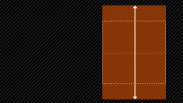
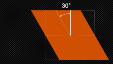

# CSS 动画

## CSS Transform 变形

CSS3 transform 是什么？
* transform 的含义是：改变,使...变形;转换
* transform 属性向元素应用2D或3D转

transform 的转换，并不是动态的，而是最终时刻的状态，没有时间轴概念，所有变化都是即时的

在CSS3中，`transform` 主要包括以下几种：旋转 `rotate`，扭曲 `skew`，缩放 `scale` 和移动 `transform` 以及矩形变形 `matrix`。

### 语法

```
transform: none | <transform-function> [ <transform-function> ]* 
也就是：
trandform：rotate | scale | skew | transform | matrix；
```

* `none`：表示不进行变化
* `<transform-function>`：表示一个或多个变换函数，以空格分开（换句话说就是同时对一个元素进行 transform 的多种属性操作，例如：rotate、scale、translate 三种）

### 旋转 rotate

`rotate(<angle>)`：通过指定的角度参数对原元素指定一个 2D rotation （2D旋转），需先有 transform-origin 属性的定义。

transform-origin 定义的是旋转的基点，其中 angle 是指旋转角度，如果设置的值为整数表示顺时针旋转，如果设置的值为负数，则表示逆时针旋转。如：
```css
{
  transform: rotate(30deg);
}
```


### 移动 translate

移动 translate 分为三种情况：
* `translate(x, y)`：水平方向和垂直方向同时移动（也就是X轴和Y轴同时移动）
* `translateX(x)`：仅水平移动（X轴移动）
* `translateY(y)`：仅垂直移动（Y轴移动）

```css
{
  transform: translate(100px, 20px);
  transform: translateX(100px);
  transform: translateY(20px);
}
```

| CSS操作 | 效果 | 描述 |
| --- | --- | --- |
| `translate(100px, 20px)` |  | 按照设定的x，y参数值，进行移动元素 |
| `translateX(100px)` |   | 按照设定的参数值，只向x轴进行移动元素 |
| `translateY(20px)` |   | 按照设定的参数值，只向Y轴进行移动 |

### 缩放 scale

缩放 scale 和移动 translate 是极其相似，也有三种情况：
* `scale(x, y)`：使元素水平方向和垂直方向同时缩放（也就是说X轴和Y轴同时缩放）
* `scaleX(x)`：元素仅水平方向缩放（X轴缩放）
* `scaleY(y)`：元素仅垂直方向缩放（Y轴缩放）

```css
{
  tranform: scale(2, 1.5);
  tranform: scaleX(2);
  tranform: scaleY(2);
}
```

| CSS操作 | 效果 | 描述 |
| --- | --- | --- |
| `tranform: scale(2, 1.5)` |  | 按照设定的x，y参数值，进行缩放元素 |
| `tranform: scaleX(2)` |  | 按照设定的x参数值，只向x轴进行缩放元素 |
| `tranform: scaleY(2)` |  | 按照设定的y参数值，只向Y轴进行缩放元素 |

### 扭曲 skew

扭曲 skew 和 translate、scale 一样同样具有三种情况：
* `skew(x, y)`：使元素在水平和垂直方向同时扭曲（x轴和y轴同时按一定角度值来进行扭曲变形）
* `skewX(<angle>)`：使元素按给定角度沿x轴指定一个skew transformation（斜切变换）。skewX是使元素以其中心为基点，并在水平方向（X轴）进行扭曲变化
* `skewY(<angle>)`：使元素按给定角度沿y轴指定一个skew transformation（斜切变换）。skewY是使元素以其中心为基点，并在垂直方向（Y轴）进行扭曲变化

```css
{
  transform: skew(30deg, 10deg);
  transform: skewX(30deg);
  transform: skewY(10deg);
}
```

| CSS操作 | 效果 | 描述 |
| --- | --- | --- |
| `tranform: skew(30deg, 10deg)` |  | 按照设定的x，y参数值，进行扭曲元素 |
| `tranform: skewX(30deg)` |  | 按照设定的x参数，只向X轴进行扭曲元素 |
| `tranform: skewY(10deg)` |  | 按照设定的y参数，只向Y轴进行扭曲元素 |


### 矩形 matrix
`matrix(<number>,<number>,<number>,<number>,<number>,<number>)`

以一个含6值的（a,b,c,d,e,f）变化矩阵的形式指定一个2D变换，相等于直接应用一个 [a b c d e f] 变化矩阵。

### 改变基点 transform-origin

transform-origin 的主要作用是在进行 transform 动作之前可以改变元素的基点位置

元素的默认基点就是其中心位置，换句话说，在没有 transform-origin 改变元素基点位置的情况下，transform 进行的 rotate，translate，scale，skew，matrix 等操作都以元素自己的中心位置进行变化的。

`transform-origin(x, y)`：用来设置元素的运动基点（参考点）。默认点是元素的中心。其中X和Y的值可以是百分值，em，px，其中X也可以是字符参数值 left、center、right；Y和X一样除了百分值外还可以设置字符值 top、center、bottom。


## Transition 过渡

W3C 标准对于 CSS3 的 transition 是这样的描述的：“CSS 的 transition 允许 CSS 的属性值在一定时间内平滑地过渡。这种效果可以在鼠标单击、获取焦点、被点击或对元素任何改变中触发，并圆滑地以动画改变CSS的属性值。”

在 transition 之前，CSS 是没有时间轴的，状态变化都是即时完成的

```
transition: [<'transition-property'> || <'transition-duration'> || <'transition-timing-function'> || <'transition-delay'>]
```

### 执行变化的属性 transition-property

```
transition-property: none | all | [ <IDENT> ]
```

transition-property 是用来指定当前元素其中一个属性改变时执行 transition，其中要有以下几个值：none（没有属性改变）；all（所有属性改变。默认值）

ident（元素属性名）。当其中为 none 时，transition 马上停止执行，当指定 all 时，则元素任何值变化时都将执行 transition 效果，index 是可以指定元素的某一个属性值，**对应类型如下：**
* color：通过红、绿、蓝和透明组件变换（每个数值处理）如：background-color，border-color，color，outline-color 等CSS属性
* length：真实的数字如：word-spacing，width，vertical-align，top，right，bottom，left，padding 等属性
* percentage：真实的数字如：word-spacing，width，vertical-align，top，right，bottom，left 等属性
* integer：离散步骤（整个数字），在真实的数字空间，以及使用 floor() 转换为整数时发生如：outline-offset，z-index 等
* number：真实的（浮点型）数值，如：zoom，opacity，font-weight，等属性
* transform
* rectangle：通过x，y，width 和 height （转换数值）变换
* visibility：离散步骤，0~1
* shadow：作用于color，x，y和blur（模糊）属性，如：text-shadow
* ...


### 变化延续的时间 transition-duration

```
transition-duration: <time>
```

transition-duration 是用来指定元素转换过程的持续时间，取值：`<time>` 为数值，单位为 s（秒）或者 ms（毫秒），可以作用于所有元素，包括 `:befor` 和 `:after` 伪元素。其默认值是 0 ，也就是变化时是即使的

### 变化的速率 transition-timing-function

```
transition-timing-function: ease | linear | ease-in | ease-out | ease-in-out | cubic-bezier(<number>， <number>， <number>， <number>) 
```

transition-timing-function 的值允许根据时间的推进去改变属性值的变换速率，transition-timing-function 有6个可能值：
* ease：（逐渐变慢）默认值，ease 函数等同于贝塞尔曲线 (0.25, 0.1, 0.25, 1.0)
* linear：（均匀），linear 函数等同于贝塞尔曲线 (0.0, 0.0, 1.0, 1.0)
* ease-in：（加速），ease-in 函数等同于贝塞尔曲线 (0.42, 0, 1.0, 1.0)
* ease-out：（减速），ease-out 函数等同于贝塞尔曲线 (0, 0, 0.58, 1.0)
* ease-in-out：（加速然后减速），ease-in-out函数等同于贝塞尔曲线 (0.42, 0, 0.58, 1.0)
* cubic-bezier：（该值允许去定义一个时间曲线），特定的cubic-bezier曲线

### 变换延迟时间 transition-delay

transition-delay 是用来指定一个动画开始执行的时间，也就是说当改变元素属性值后多长时间开始执行 transition 效果，其取值：`<time>` 为数值，单位为秒（s）或者毫秒（ms）其使用的个 transition-duration 极其相似，也可以作用于所有元素，包括 `:before` 和 `:after` 伪元素。默认大小是 "0"，也就是变换立即执行，没有延迟

### 合并 transition 属性

可以合并 transition 属性，（例如改变背景，与颜色）只要把几个 transition 的声明串在一起，用逗号（","）隔开，然后各自属性就有不同的延续时间和其时间的速率变换方式。

> 注意：transition-delay 和 transition-duration 的值都是时间，所以要区分它们在连写中的位置，一般浏览器会根据顺序决定，第一个解析为持续时间 transition-duration 第二个为 transition-delay 

```css
{
  -moz-transition: background 0.5s ease-in, color 0.3s ease-out;
  -webkit-transition: background 0.5s ease-in, color 0.3s ease-out;
  -o-transition: background 0.5s ease-in, color 0.3s ease-out;
  transition: background 0.5s ease-in, color 0.3s ease-out;
}
```

给元素执行所以 transition 效果的属性，可以使用 all 属性值来操作
```css
{
  transition: all 0.5s ease-in;
}
```

### transition 的局限
* transition 需要事件触发，没法再网页加载时自动发生
* transition 是一次性的，不能重复发生，除非一再触发
* transition 只能定义开始状态和结束状态，不能定义中间状态，也就是说只有两个状态
* 一条 transition 规定，只能定义一个属性的变化，不涉及多个属性

## Animation 动画

CSS 中的 Animation 与 HTML5 中的 Canvas 绘制动画不同，Animation 只应用于已存在的 DOM 元素上，而且跟 Flash 和 JavaScript 以及 JQuery 制作出来的动画效果又不一样。因为Animation制作动画可以省去复杂的js，jquery代码

使用 transition 制作一个简单的 transition 效果来，包括了初始属性和最终属性，如果想控制的更细一些，比如第一个时间段执行什么动作，第二个时间执行什么动作，这样使用 transition 就很难实现了，这时需要一个"关键帧"来控制，CSS3的 Animation 就是由 "keyframes" 这个属性来实现这样的效果

Keyframes 具有自己的语法规定，它的命名是由 "@keyframes" 开头，后面跟着这个“动画名称”加上一对花括号"{}"，括号中就是一些不同时间段样式规则：

| 属性名 | 动画完成度 |
| --- | --- |
| from | 0% |
| ** | 50% |
| to | 100% |

```css
/* ====================== animation简写 ========================== */
{
  animation: 1s rainbow infinite;    /* 无限次播放 */
  animation: 1s rainbow 10;          /* 播放10次 */
}
div:hover {
    animation: 2s 1s rainbow linear 3 forwards normal;
}
div:hover {
    animation-name: rainbow;            /* 规定需要绑定到选择器的keyframe名称 */
    animation-duration: 2s;             /* 规定完成动画花费的时间 */
    animation-timing-function: linear;  /* 规定动画的速度曲线 */
    animation-delay: 1s;                /* 规定动画开始之前延迟 */
    animation-fill-mode: forwards;      /* 规定动画在播放之前或之后,其动画效果是否可见 */
    animation-direction: normal;        /* 规定是否应该轮流反向播放动画 */
    animation-iteration-count: 3;       /* 规定动画播放的次数 */
}
```

### animation-fill-mode 动画结束状态

animation-fill-mode 规定动画在播放之前或之后,其动画效果是否可见

动画结束以后,会立即从结束状态跳回到起始状态.如果想让动画保存在结束状态,需要使用animation-fill-mode属性：
* none：默认值，回到动画没开始的状态
* backwards：让动画回到第一帧的状态
* forwards：让动画停留在动画结束的状态
* both：结束后可遵循 forwards 和 backwards 两个规则

### animation-direction 动画循环状态

规定是否应该轮流反向播放动画

动画循环播放后,每次播放都是回到开始的状态,这个属性可以修改：
* normal：默认值，动画应该正常播放
* reverse：反向运行动画，每周期结束动画由尾到头运行
* alternate：动画应该轮流反向播放
* alternate-reverse：反向交替

### keyframes 动画命名

```css
/* from=0%   to=100% */
@keyframes rainbow {
  from { background: #c00; }
  50% { background: orange; }
  to { background: yellowgreen; }
}
/* 上面的 等于 下面这个写法*/
@keyframes rainbow {
  0% { background: #c00; }
  50% { background: orange; }
  100% { background: yellowgreen; }
}

@keyframes pound {
  from，to { transform: none; }
  50% { transform: scale(1.2); }
}

/* 另外一点需要注意的是，浏览器从一个状态向另一个状态过渡，是平滑过渡 steps函数可以实现分步过渡 */
div:hover {
  animation: 1s rainbow infinite steps(10);
}
```

### animation-play-state 暂停动画

使动画暂停或播放：
* paused：规定动画已暂停
* running：规定动画正在播放
