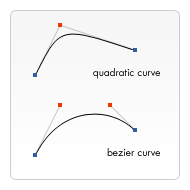

# canvas

> 具体内容可以查看[详情](https://developer.mozilla.org/zh-CN/docs/Web/API/Canvas_API)

## 基本用法

```html
<canvas id="canvas" width="150" height="150"></canvas>
<!-- 浏览器不支持canvas时，在canvas标签中提供替换内容 -->
<canvas id="canvas" width="150" height="150">
  
</canvas>
```

### 渲染上下文

\<canvas>元素创造了一个固定大小的画布，它公开了一个或多个渲染上下文，其可以用来绘制和处理要展示的内容。

document.getElementById()方法来为 \<canvas>元素得到DOM对象。

一旦有了元素对象，就可以通过getContext()方法来绘制上下文。


```js
const canvas = document.getElementById('canvas');
const ctx = canvas.getContext('2d')
```

### 检查支持性

替换内容是用在不支持\<canvas>标签的浏览器中展示的。通过简单的测试getContext()方法的存在，脚本可以检查编程支持性。

```js
const canvas = document.getElementById('canvas');

if(canvas.getContext) {
  // 支持时
  const ctx = canvas.getContext('2d')
} else {
  // 不支持时   
}
```


## 绘制形状

### 栅格

HTML模板中有个宽150px, 高150px的canvas元素，canvas元素默认被网格所覆盖。通常来说网格中的一个单元相当于canvas元素中的一像素，栅格的起点为左上角（坐标为（0,0））。

所有元素的位置都相对于原点定位。所以图中蓝色方形左上角的坐标为距离左边（X轴）x像素，距离上边（Y轴）y像素（坐标为（x,y））。


### 绘制矩形

不同于SVG，HTML中的元素canvas只支持一种原生的图形绘制：矩形。所有其他的图形的绘制都至少需要生成一条路径。

canvas提供了三种方法绘制矩形的：
```js
// 绘制一个填充的矩形
fillRect(x, y, width, height);
// 绘制一个矩形的边框
strokeRect(x, y, width, height);
// 清除指定矩形区域，让清除部分完全透明。
clearRect(x, y, width, height);
```

| 展示 | 步骤 |
| --- | --- |
| <Canvas-Rect /> | ```1.  ctx.fillRect(25, 25, 100, 100)``` <br /> ```2. ctx.clearRect(45, 45, 60, 60)```<br /> ```3. ctx.strokeRect(50, 50, 50, 50)``` |
 
fillRect()函数绘制了一个边长为100px的黑色正方形, clearRect()函数从正方形的中心开始擦出了一个60\*60px的正方形，接着strokeRect()在清除区域内生产一个50\*50的正方形边框。


### 绘制路径

图形的基本元素是路径。路径是通过不同颜色和宽度的线段和曲线相连形成不同的形状的点的集合。一个路径，甚至一个子路径，都是闭合的。使用路径绘制图形需要一些额外的步骤。

1. 首先，需要创建路径起始点。
2. 然后使用画图命令去画出路径。
3. 之后把画出的路径封闭。
4. 一旦生成路径，就能通过描边或填充路径区域来渲染图形。

所用到的函数：
```js
// 新建一条路径，生成之后，图形绘制命令被指向到路径上生成路径。
beginPath();
// 闭合路径之后图形绘制命令又重新指向到上下文中。
closePath();
// 通过线条来绘制图形轮廓。
stroke();
// 通过填充路径的内容区域生成实心的图形。
fill();
```
| 展示 | 步骤 |
| --- | --- |
| <Canvas-Path /> | ``` 1. ctx.beginPath(); ``` <br /> ```2. ctx.moveTo(75, 50); ``` <br /> ``` 3. ctx.lineTo(100, 75);```<br /> ``` 4. ctx.lineTo(100, 25); ```<br />``` 5. ctx.fill();```|

#### 移动笔触

```moveTo()```一个非常有用的函数，这个函数实际上不能画出任何东西，也是上面所描述的路径列表的一部分。将画笔的的笔尖出一个点移动到另一个点的过程。

```js 
// 将笔触移动到指定的坐标x以及y上
moveTo()
```

当canvas初始化或者beginPath()调用后，通常会使用moveTo()函数设置起点；也能够使用moveTo()绘制一些不连续的路径。


<Canvas-MoveTo />

```js
const ctx = canvas.getContext('2d');
ctx.beginPath();
ctx.arc(75, 75, 50 ,0 ,Math.PI*2 ,true); // 绘制
ctx.moveTo(110, 75);
ctx.arc(75, 75, 35 ,0 ,Math.PI, false);   // 口(顺时针)
ctx.moveTo(65, 65);
ctx.arc(60, 65, 5, 0, Math.PI*2, true);  // 左眼
ctx.moveTo(95, 65);
ctx.arc(90, 65, 5, 0, Math.PI*2, true);  // 右眼
ctx.stroke();
```

#### 线

绘制直线，需要用到方法```lineTo()```。

```js
// 绘制一条从当前位置到指定x以及y位置的直线
lineTo(x, y);
```

使用```lineTo()```绘制图形时，需要注意填充方式，使用```fill()```填充路径生成实心图形，不需要使用```closePath()```，当使用```stroke()```绘制图形轮廓时，需要先使用```closePath()```闭合图形才可以。


#### 圆弧

绘制圆弧或者圆，使用arc()方法。当然可以使用arcTo()，不过这个实现不可靠，不做讨论。
```js
/**
* x,y:            圆心所在位置
* radius:         半径
* startAngle:     开始位置
* endAngle:       结束位置
* anticlockwise   画圆方向（默认为顺时针）
* 
* arc函数中角的单位是弧度，不是角度——角度与弧度的js表达式:  弧度=(Math.PI/180)*角度
*/
arc(x, y, radius, startAngle, endAngle, anticlockwise)

```

<Canvas-Arc />

```js
const ctx = document.getElementById('canvasArc').getContext('2d');

ctx.beginPath();

ctx.arc(50, 50, 50, 0, 2*Math.PI, false);
ctx.fillStyle = 'rgba(255, 85, 45, 0.6)';
ctx.fill();

ctx.beginPath();

ctx.arc(150, 50, 50, 0, 2*Math.PI, false);
ctx.strokeStyle = 'rgba(85, 45, 255, 0.6)';
ctx.stroke();
```


#### 二次贝塞尔曲线及三次贝塞尔曲线
```js
// 绘制二次贝塞尔曲线，cp1x,cp1y为一个控制点，x,y为结束点。
quadraticCurveTo(cp1x, cp1y, x, y)
// 绘制三次贝塞尔曲线，cp1x,cp1y为控制点一，cp2x,cp2y为控制点二，x,y为结束点。 
bezierCurveTo(cp1x, cp1y, cp2x, cp2y, x, y)
```

 

上图能够很好的描述两者的关系，二次贝塞尔曲线有一个开始点（蓝色）、一个结束点（蓝色）以及一个控制点（红色），而三次贝塞尔曲线有两个控制点。 


#### 矩形

直接在画布上绘制矩形的三个额外方法，```rect()```方法，将一个矩形添加到当前路径上。
```js
// 绘制一个左上角坐标为（x,y），宽高为width以及height的矩形
rect(x, y, width, height);
```
当该方法执行的时候，moveTo()方法自动设置坐标参数(0, 0)。也就是说，当前笔触自动重置回默认坐标。

### Path2D 对象

正如之前看到的，可以使用一系列的路径和绘图命令把对象"画"在画布上。为了简化代码和提高性能，Path2D对象已可以在较新版本的浏览器中使用，用来缓存或记录绘画命令，这样你将能快速地回顾路径。

怎么生成一个Path2D对象呢？

#### Path2D()
```js
/**
* Path2D()会返回一个新初始化的Path2D对象
* 可能将某一个路径作为变量——创建一个它的副本，或者将一个包含SVG path数据的字符串作为变量
*/

new Path2D();     // 空的Path对象
new Path2D(path); // 克隆Path对象
new Path2D(d);    // 从SVG建立Path对象
```

所有的路径方法比如moveTo, rect, arc或quadraticCurveTo等，如我们前面见过的，都可以在Path2D中使用。

Path2D API添加了addPath作为将path结合起来的方法。当你想要从几个元素中来创建对象时，这将会很实用。比如：```Path2D.addPath(path [, transform])```

<Canvas-Path2D />

```js
const ctx = canvas.getContext();

const rectangle = new Path2D();
rectangle.rect(10, 10, 50, 50);

const circle = new Path2D();
circle.moveTo(125, 35);
circle.arc(100, 35, 25, 0, 2 * Math.PI);

ctx.stroke(rectangle);
ctx.fill(circle);
```

#### 使用 SVG paths
新的Path2D API有另一个强大的特点，就是使用SVG path data来初始化canvas上的路径

这将使你获取路径时可以以SVG或canvas的方式来重用它们：
```js
const p = new Path2D("M10 10 h 80 v 80 h -80 Z");
```

## 使用样式和颜色

### 色彩 Colors

想要给图形上色，有两个重要的属性可以做到：```fillStyle```和```strokeStyle```。
```js
// 设置图形的填充颜色
fillStyle = color;
// 设置图形轮廓的颜色
strokeStyle = color;
```
```color```可以是表示CSS颜色的字符串，渐变对象或者图案对象。默认情况下，线条和填充颜色都是黑色(CSS 颜色值```#000000```)

::: warning
注意: 一旦设置了 strokeStyle 或者 fillStyle 的值，那么这个新值就会成为新绘制的图形的默认值。如果要给每个图形上不同的颜色，需要重新设置 fillStyle 或 strokeStyle 的值。
:::

```js
// 这些 fillStyle 的值均为 '橙色'
ctx.fillStyle = "orange";
ctx.fillStyle = "#FFA500";
ctx.fillStyle = "rgb(255,165,0)";
ctx.fillStyle = "rgba(255,165,0,1)";
```

### 透明度 Transparency
通过设置 globalAlpha 属性或者使用一个半透明颜色作为轮廓或填充的样式。
```js
globalAlpha = transparencyValue
```
这个属性影响到 canvas 里所有图形的透明度，有效的值范围是 0.0 （完全透明）到 1.0（完全不透明），默认是 1.0。

可以直接用CSS3色彩规范来规定透明度：
```js
// 指定透明颜色，用于描边和填充样式
ctx.strokeStyle = "rgba(255,0,0,0.5)";
ctx.fillStyle = "rgba(255,0,0,0.5)";
```

### 线型 Line styles
可以通过一系列属性来设置线的样式
```js
// 设置线条宽度
lineWidth = value;
// 设置线条末端样式
lineCap = type;
// 设定线条与线条间接合处的样式
lineJoin = type;
// 限制当两条线相交时交接处最大长度
miterLimit = value;
// 返回一个包含当前虚线样式，长度为非负偶数的数组
getLineDash();
// 设置当前虚线样式
setLineDash();
// 设置虚线样式的起始偏移量
lineDashOffset = value
```

### 渐变 Gradients

可以用线性或者径向的渐变来填充或描边，可以用下面的方法新建一个```canvasGradient```对象，并且赋给图形```fillStyle```或```strokeStyle```属性。
```js
/**
 * createLinearGradient 方法接受 4 个参数
 * 表示渐变的起点 (x1,y1) 与终点 (x2,y2)
 */
createLinearGradient(x1, y1, x2, y2);

/**
* createRadialGradient 方法接受 6 个参数
* 前三个定义一个以 (x1,y1) 为原点，半径为 r1 的圆
* 后三个参数则定义另一个以 (x2,y2) 为原点，半径为 r2 的圆
*/
createRadialGradient(x1, y1, r1, x2, y2, r2);
```

创建出```canvasGradient```对象后，就可以用```addColorStop```方法给它上色。
```js
/**
* addColorStop 方法接受 2 个参数
* position 参数必须是一个 0.0 与 1.0 之间的数值，表示渐变中颜色所在的相对位置
* ——例如，0.5 表示颜色会出现在正中间
* color 参数必须是一个有效的 CSS 颜色值（如 #FFF， rgba(0,0,0,1)，等等）
*/
gradient.addColorStop(position, color);
```
| 线性渐变 | 径向渐变 |
|---|---|
|<Canvas-LinearGradient /> | <Canvas-RadialGradient /> |

### 图案样式 Patterns

```createPattern(image, type)```
该方法接受两个参数。Image可以是一个```Image```对象的引用，或者另一个canvas对象。```Type```必须是下面的字符串之一：```repeat```，```repeat-x```，```repeat-y``` 和 ```no-repeat```

<Canvas-CreatePattern />

### 阴影 Shadows

```shadowOffsetX = float```、```shadowOffsetY = float```

```shadowOffsetX```和```shadowOffsetY```用来设置阴影在X和Y轴的延伸距离，它们是不受变化矩形阵影响的。负值表示阴影会往上或左延伸，正值则表示会往下或右延伸，它们默认都为 0。

```shadowBlur = float```

shadowBlur 用于设定阴影的模糊程度，其数值并不跟像素数量挂钩，也不受变换矩阵的影响，默认为 0。

```shadowColor = color```

shadowColor 是标准的 CSS 颜色值，用于设定阴影颜色效果，默认是全透明的黑色。

<Canvas-Shadows />


## 绘制文本

canvas提供两种方法来渲染文本：

```fillText(text, x, y, [, maxWidth])```

在指定的(x,y)位置填充指定的文本，绘制的最大宽度是可选的

```strokeText(text, x, y [, maxWidth])```

在指定的(x,y)位置绘制文本边框，绘制的最大宽度是可选的

| 填充文本 | 绘制文本边框 |
| --- | --- |
| <Canvas-FillText /> | <Canvas-StrokeText /> |

### 有样式的文本

还有更多的属性可以让你改变canvas显示文本的方式：

```font = value```

当前我们用来绘制文本的样式. 这个字符串使用和 CSS font 属性相同的语法. 默认的字体是 10px sans-serif。


```textAlign = value```

文本对齐选项. 可选的值包括：start, end, left, right or center. 默认值是 start。

```textBaseline = value```

基线对齐选项. 可选的值包括：top, hanging, middle, alphabetic, ideographic, bottom。默认值是 alphabetic。

```direction = value```

文本方向。可能的值包括：ltr, rtl, inherit。默认值是 inherit。


### 预测量文本宽度

当需要获得更多的文本细节时，下面的方法可以给你测量文本的方法：

```measureText()```

将返回一个 TextMetrics对象的宽度、所在像素，这些体现文本特性的属性。

```js
const ctx = document.getElementById('canvas').getContext('2d');
const text = ctx.measureText("foo"); // TextMetrics object
text.width; // 16;
```

## 使用图像

canvas更有意思的一项特性就是图像操作能力。可以用动态的图像合成或者作为图形的背景，以及游戏界面（Sprites）等等。

浏览器支持的任意格式的外部图片都可以使用，比如PNG、GIF或者JPEG。 甚至可以将同一个页面中其他canvas元素生成的图片作为图片源。

引入图像到canvas里需要以下两个基本操作：
1. 获得一个指向```HTMLImageElement```的对象或者另一个canvas元素的引用作为源，也可以通过提供一个URL的方式来使用图片
2. 使用```drawImage()```函数将图片绘制到画布上


### 获得需要绘制的图片

canvas的API可以使用下面这些类型中的一种作为图片的源：

```HTMLImageElement```

这些图片是由```Image()```函数构造出来的，或者任何的元素

```HTMLVideoElement```

用一个HTML的 ```<video>```元素作为你的图片源，可以从视频中抓取当前帧作为一个图像

```HTMLCanvasElement```

可以使用另一个 ```<canvas>``` 元素作为你的图片源。

```ImageBitmap```

这是一个高性能的位图，可以低延迟地绘制，它可以从上述的所有源以及其它几种源中生成。

#### 使用相同页面内的图片

可以通过下列方法的一种来获得与canvas相同页面内的图片的引用：

* ```document.images```集合
* ```document.getElementsByTagName()```方法
* 如果你知道你想使用的指定图片的ID，你可以用```document.getElementById()```获得这个图片

#### 使用其他域名下的图片

在`HTMLImageElement`上使用`crossOrigin`属性，可以请求加载其他域名商的图片。如果图片的服务器允许跨域访问这个图片，那么可以使用这个图片而不污染canvas，否则，使用这个图片将会污染canvas。


#### 使用其它 canvas 元素

和引用页面内的图片类似地，用`document.getElementsByTagName`或`document.getElementById`方法获取其他canvas元素。但引入的应该是已经准备好的canvas。

一个常用的应用就是将第二个canvas作为另一个大的 canvas 的缩略图

#### 由零开始创建图像

或者可以用脚本创建一个新的 HTMLImageElement 对象。要实现这个方法，我们可以使用很方便的Image()构造函数。

```js
const img = new Image();    // 创建一个元素
img.src = 'myImage.png';    // 设置图片源地址
```

当脚本执行后，图片开始装载

若调用`drawImage`时，图片没有加载完，那么什么也不会发生（在一些旧的浏览器中可能会抛出异常）。因此应该用load事件来保证不会在加载完毕之前使用这个图片：

```js
const img = new Image();  // 创建img元素
img.onload = () => {
  // 执行drawImage 语句
};
img.src = 'myImage.png';  // 设置图片源地址
```

如果你只用到一张图片的话，这已经够了。但一旦需要不止一张图片，那就需要更加复杂的处理方法（图片预加载策略）。

#### 通过data:url方法嵌入图像

```js
img.src = 'data:image/gif;base64,R0lGODlhCwALAIAAAAAA3pn/ZiH5BAEAAAEALAAAAAALAAsAAAIUhA+hkcuO4lmNVindo7qyrIXiGBYAOw==';
```

其优点就是图片内容即使可用，无须再去服务器请求一次，（还有一个优点是，可以将 CSS，JavaScript，HTML 和 图片全部封装在一起，迁移起来十分方便），缺点就是图像没法缓存，图片大的话内嵌的 url 数据会相当的长。

#### 使用视频帧

还可以使用`<video>` 中的视频帧（即便视频是不可见的）。例如，如果有一个ID为“myvideo”的`<video>`元素，可以这样做：

```js
function getMyVideo() {
  const ctx = document.getElementById('canvas').getContext('2d');
  
  return document.getElementById('myvideo');
}
```

它将为这个视频返回`HTMLVideoElement`对象，正如前面提到的，它可以作为`Canvas`图片源。


### 绘制图片

一旦获得了源图对象，就可以使用`drawImage`方法将它渲染到canvas里。`drawImage`方法有三种形态，下面是最基础的一种：

`drawImage(image, x, y)`

其中image是image或者canvas对象，x和y是其在目标canvas里的起始坐标。

```js
const ctx = document.getElementById('canvas').getContext('2d');
const img = new Image();
img.onload = () => {
  ctx.drawImage(img, 0, 0);
};
img.src = 'https://mdn.mozillademos.org/files/5397/rhino.jpg';
```

### 缩放 Scaling

`drawImage`方法的又一变种是增加了两个用于控制图像在`canvas`中缩放的参数。

`drawImage(images, x, y, width, height)`

这两个方法多了两个参数，`width`和`height`，这两个参数用来控制当向canvas画入时应该缩放的大小

```js
const ctx = document.getElementById('canvas').getContext('2d');
const img = new Image();
img.onload = () => {
  ctx.drawImage(img, 50, 38, 50, 38);
};
img.src = 'https://mdn.mozillademos.org/files/5397/rhino.jpg';
```

### 切片 Slicing

drawImage 方法的第三个也是最后一个变种有8个新参数，用于控制做切片显示的。

`drawImage(image, sx, sy, sWidth, sHeight, dx, dy, dWidth, dHeight)`

第一个参数和其它的是相同的，都是一个图像或者另一个canvas的引用。其它8个参数最好是参照右边的图解

前4个是定义图像源的切片位置和大小；

后4个则是定义切片的目标显示位置和大小。

```js
const ctx = document.getElementById('canvas').getContext('2d');

ctx.drawImage(document.getElementById('source'), 33,71,104,124,21,20,87,104);
```

### 控制图像的缩放行为

Gecko 1.9.2 引入了 mozImageSmoothingEnabled 属性，值为 false 时，图像不会平滑地缩放。默认是 true 。

`cx.mozImageSmoothingEnabled = false;`


## 变形

变形是一种更强大的方法，可以将原点移动到另一点、对网格进行旋转和缩放。

### 状态的保存和恢复

绘制复杂图形时必不可少的两个方法：

`save()`

保存画布canvas的所以状态

`restore()`

save 和 restore 方法是用来保存和恢复 canvas 状态的，都没有参数。Canvas 的状态就是当前画面应用的所有样式和变形的一个快照。

Canvas状态存储在栈中，每当save()方法被调用后，当前的状态就被推送到栈中保存。一个绘画状态包括：
* 当前应用的变形
* strokeStyle, fillStyle, globalAlpha, lineWidth, lineCap, lineJoin, miterLimit, shadowOffsetX, shadowOffsetY, shadowBlur, shadowColor, globalCompositeOperation 的值
* 当前的裁切路径（clipping path）

> 可以调用任意次`save`方法，每一次调用restore方法，上一个保存的状态就从栈中弹出，所有设定都恢复。

<Canvas-SaveAndRestore />

```js
const ctx = document.getElementById('canvasSaveAndRestore').getContext('2d');

ctx.fillRect(0, 0, 150, 150);                 // 使用默认设置绘制一个矩形
ctx.save();                                   // 保存默认状态

ctx.fillStyle = '#09F';                       // 在原有配置基础上对颜色做改变
ctx.fillRect(15, 15, 120, 120);               // 使用新的设置绘制一个矩形

ctx.save();                                   // 保存当前状态
ctx.fillStyle = 'rgba(255, 255, 255, 0.5)';   // 再次改变颜色配置
ctx.fillRect(30, 30, 90, 90);                 // 使用新的配置绘制一个矩形

ctx.restore();                                // 重新加载之前的颜色状态
ctx.fillRect(45, 45, 60, 60);                 // 使用上一次的配置绘制一个矩形

ctx.restore();                                // 加载默认颜色配置
ctx.fillRect(60, 60, 30, 30);                 // 使用加载的配置绘制一个矩形
```

### 移动 Translating

先介绍`translate`方法，它用来移动canvas和它的原点到一个不同的位置。

`translate(x, y)`

`translate`方法接受两个参数。x是左右偏移量，y是上下偏移量，如下图：


在做变形之前先保存状态是一个良好的习惯。大多数情况下，调用restore方法比手动恢复原先的状态要简单得多。

<Canvas-Translate />

```js
const ctx = document.getElementById('canvasTranslate').getContext('2d');
for (let i = 0; i < 3; i++) {
  for (let j = 0; j < 3; j++) {
    ctx.save();
    ctx.fillStyle = `rgb(${51 * i}, ${255 - 51 * i}, 255)`
    ctx.translate(10 + j * 50, 10 + i * 50);
    ctx.fillRect(0, 0, 25, 25);
    ctx.restore();
  }
}
```

### 旋转 Rotating

第二个介绍`rotate`方法它用于以原点为中心选择canvas。

`rotate(angle)`

这个方法只接受一个参数：旋转的角度(angle)，它是顺时针方向的，以弧度为单位的值。

旋转中心始终是canvas的原点，如果要改变它，需要使用`translate`方法。

<Canvas-Rotate />

```js
const ctx = document.getElementById('canvasRotate').getContext('2d');
ctx.translate(75,75);

for (let i = 1; i < 6; i++) {
  ctx.save();

  ctx.fillStyle = `rgb(${51*i}, ${255-51*i}, 255)`;

  for (let j = 0; j < i*6; j++) {
    ctx.rotate(Math.PI*2/(i*6));
    ctx.beginPath();
    ctx.arc(0, i*12.5, 5, 0, Math.PI*2, true);
    ctx.fill();
  }
  ctx.restore();
}
```

### 缩放 Scaling

缩放，用它来增减图形在 canvas 中的像素数目，对形状，位图进行缩小或者放大。

`scale(x, y)`

`scale`方法可以缩放画布的水平和垂直的单位。两个参数都是实数，可以为负数，x 为水平缩放因子，y 为垂直缩放因子，如果比1小，会比缩放图形， 如果比1大会放大图形。默认为1，为实际大小。

如果参数为负实数，相当于以x轴或y轴作为对称性镜像反转

<Canvas-Scale />

```js
const ctx = document.getElementById('canvasScale').getContext('2d');
ctx.save();
ctx.scale(10, 3);
ctx.fillRect(1, 10, 10, 10);
ctx.restore();

ctx.scale(-1, 1);
ctx.font = '48px serif';
ctx.fillText('MDN', -135, 120);
```

## 合成与裁剪

### globalCompositeOperation

不仅可以在已有图形后面再画新图形，还可以用来遮盖指定区域，清除画布中的某些部分

`globalCompositeOperation = type`

这个属性设定了在画新图形时采用的遮盖策略，其值是一个标识12种遮盖方式的字符串。[详情](https://developer.mozilla.org/zh-CN/docs/Web/API/Canvas_API/Tutorial/Compositing)

### 裁切路径

裁切路径和普通的canvas图形差不多，不同的是它的作用是遮罩，用来隐藏不需要的部分。

`clip()`


将当前正在构建的路径转换为当前的裁剪路径。

<Canvas-Clip />

用一个圆形的裁切路径来限制随机星星的绘制区域。

首先，画了一个与`canvas`一样大小的黑色方形作为背景，然后移动原点至中心点。然后用`clip`方法创建一个弧形的裁切路径。裁切路径也属于`canvas`状态的一部分，可以被保存起来。如果在创建新裁切路径时想保留原来的裁切路径，需要做的就是保存一下`canvas`的状态。

裁切路径创建之后所有出现在它里面的东西才会画出来。在画线性渐变时我们就会注意到这点。然后会绘制出50 颗随机位置分布（经过缩放）的星星，当然也只有在裁切路径里面的星星才会绘制出来。
