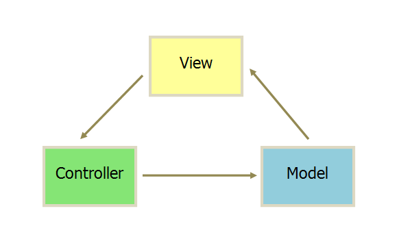
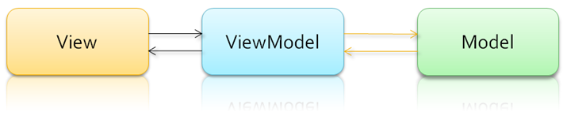

# MV* 设计技巧

[[toc]]

# MVC

## MVC 概念

* MVC设计模式是一种常用的软件架构方式，以 Controller，Model，View 三个模块分离的形式来组织代码
* MVC 的核心思想（本质）是业务数据抽取同业务数据呈现相分离

## MVC 分层

MVC 模式代表 Model-View-Controller（模型-视图-控制器）模式。这种模式用于应用程序的分层开发。
* Model（模型）- 模型层，业务数据的信息表示，关注支持业务的信息构成，通常是多个业务实体的组合
* View（视图）- 视图层，为用户提供 UI 重点关注数据的呈现
* Controller（控制器）- 控制层，调用业务逻辑产生合适的数据（Model），传递数据给视图层用于呈现

## MVC 基本流程

控制层接受客户端的请求，调用模型层生成业务数据，传递给视图层，将最终的业务数据和视图响应给客户端做展示

## MVC 优点

* 各层的耦合度低
* 可重用性高
* 可维护性高
* 部署快，生命周期短

## MVC 缺点

* 没有明确的定义
* 不适合小型，中等规模的应用程序
* 增加系统结构和实现的复杂性
* 视图与控制器间的过于紧密的连接
* 视图对模型数据的低效率访问
* 一般高级的界面工具或构造器不支持模式

# MVP

## MVP 优点

* 模型与视图完全分离，我们可以修改视图而不影响模型
* 可以更高效地使用模型，因为所有的交互都发生在一个地方—— Presenter 内部
* 我们可以将一个 Presenter 用于多个视图，而不需要改变 Presenter 的逻辑。
* 如果我们把逻辑放在Presenter中，那么我们就可以脱离用户接口来测试这些逻辑（单元测试）

## MVP 缺点

由于对视图的渲染放在了 Presenter 中，所以视图和 Presenter 的交互会过于频繁。还有一点需要明白，如果Presenter过多地渲染了视图，往往会使得它与特定的视图的联系过于紧密。

一旦视图需要变更，那么Presenter也需要变更了。

## MVP 和 MVC 的区别

作为一种新的模式，MVP 与 MVC 有着一个重大的区别：在 MVP 中 View 并不直接使用 Model，它们之间的通信是通过 Presenter ( MVC 中的 Controller ) 来进行的

所有的交互都发生在 Presenter 内部，而在 MVC 中 View 会直接从 Model 中读取数据而不是通过 Controller。

在 MVC 里，View 是可以直接访问 Model 的！从而，View 里会包含 Model 信息，不可避免的还要包括一些业务逻辑。

在 MVC 模型里，更关注的 Model 的改变，所以，在 MVC 模型里，Model 不依赖于 View，但是 View 是依赖于 Model 的。

虽然 MVC 中的 View 的确“可以”访问 Model，但是我们不建议在 View 中依赖 Model，而是要求尽可能把所有业务逻辑都放在 Controller 中处理，而 View 只和 Controller 交互。

# MVVM <Badge text="推荐"/>

## MVVM 概念

如今主流的 web 框架基本采用的是 MVVM 模式，为什么放弃 MVC 模式，转而投向了 MVVM 模式呢。在之前的 MVC 中我们提到一个控制器对应一个视图，控制器用状态机进行管理，这里就存在一个问题，如果项目足够大的时候，状态机的代码量就变得非常臃肿，难以维护。

还有一个就是性能问题，在 MVC 中我们大量操作了 DOM ，而大量操作 DOM 会让页面渲染性能降低，加载速度变慢，影响用户体验。

最好就是当 Model 频繁变化的时候，开发者就主动更新 View，那么数据的维护就变得困难。

这个时候，MVVM 模式在前端中应用就应运而生。MVVM 让用户界面和逻辑分离更加清晰。

## MVVM 模式的组成部分

* 模型：模型是指代真实状态内容的领域模型（面向对象），或指代内容的数据访问层（以数据为中心）
* 视图：就像在 MVC 和 MVP 模型中一样，视图是用户在屏幕上看到的结构、布局和外观（UI）
* 视图模型：视图模型是暴露公共属性和命令的视图的抽象，MVVM 没有 MVC 模型的控制器，也没有 MVP 模型的 presenter，有的是一个绑定器。在视图模型中，绑定器在视图和数据绑定器之间进行通信
* 绑定器：声明性数据和命令绑定隐含在 MVVM 模式中

## MVVM 优点

MVVM 模式和 MVC 模式一样，主要目的是分离视图（View）和模型（Model），有几大优点
* 低耦合
* 可重用性
* 独立开发
* 可测试

## MVVM 与 MVP 区别

MVVM 模式将 Presener 改名为 View Model，基本上与 MVP 模式完全一致，唯一的区别是，它采用双向绑定 (data-binding): View 的 变动，自动反映在 View Model，反之亦然。这样开发者就不用处理接收事件和 View 更新的工作，框架已经帮你做好了。

## 总结 <Badge text="演变"/>

这些模式是依次进化而形成 MVC—>MVP—>MVVM。在以前传统的开发模式当中即 MVC 模式，前端人员只负责 Model（数据库） View（视图） Controller /Presenter/ViewModel（控制器） 当中的View（视图）部分，写好页面交由后端创建渲染模板并提供数据

随着 MVP/MVVM 模式的出现前端已经可以自己写业务逻辑以及渲染模板，后端只负责提供数据即可
