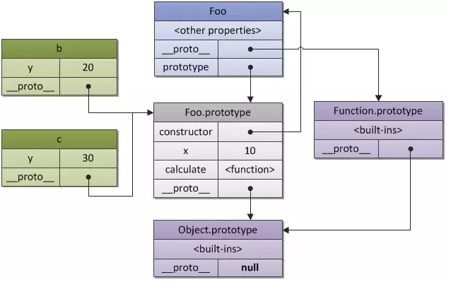

# 原型链



## 什么是原型链

每个对象都可以有一个原型 `__proto`，这个原型还可以有它自己的原型，以此类推，形成一个原型链。查找特定属性的时候，我们先去这个对象里去找，如果没有的话就去它的原型对象里找，如果还没有的话再去原型对象的原型对象里找..... 这个操作被委托在整个原型链上，这个就是我们说的原型链了。

## 原型指针

接下来，我们就照着上面的图来具体分析一下原型的指针：中间最上面蓝色模块标准的构造函数 Foo，里面有两属性，`__proto__` 和 `prototype`，这两个很容易使人混淆。

### `prototype`

prototype 属性，它是**函数所独有的**，它是从**一个函数指向一个对象**。它的含义是函数的原型对象，也就是这个函数（其实所有函数都可以作为构造函数）所创建的实例原型对象；这个属性是一个指针，指向一个对象，这个对象的用途就是包含所有实例共享的属性和方法（我们把这个对象叫原型对象）

### `__proto__`

`__proto__` 是原型链查询中实际得到的，它总指向 prototype，换句话说就是指向构造函数的原型对象，它是**对象独有的**。注意，为什么 Foo 构造也有这个属性呢，因为再 JS 的宇宙里万物皆对象，包括函数

根据上面的概括我们能知道 Foo 构造函数 `__proto` 指向的是他的构造函数的原型对象，它的构造函数时 Function，也就是说 Foo 的 `__proto` 指向 `Function.prototype`

我们再看到左边绿色的 a 和 b 函数的 `__proto__` 指像的是 Foo.prototype，因为他们是通过 new Foo 实例化出来的，它们的构造函数就是 Foo(), 即 `a.__proto__ = Foo.prototype`

接着我们来看看最右边紫色的模块 `Function.prororype`，它的 `__proto__` 指针指向的是 `Object.prototype`， `Object.__proto__` 又为 `null`

于是我们就可以得出：在原型链中的指向是，`函数 → 构造行数  → Function.prototype → Object.protype → null` ;

### `constructor`

我们看到途中最中间灰色模块有一个 constructor 属性，这个又是做什么用的呢？

> 每个函数都有一个原型对象，该原型对象有一个 constructor 属性，指向创建对象的函数本身。

此外，我们还可以使用 constructor 属性，所有的实例对象都可以访问 constructor 属性，constructor 属性是创建实例对象的函数的引用。我们可以使用 constructor 属性验证实例的原型类型（与操作符 instanceof 非常类似）。


## 创建对象的几种方式

### 第一种方式

```js
const o1 = {name: '张三'};    // 字面量
const o2 = new Object({name: '张三'});
```

### 第二种方式：构造函数创建

```js
class M {
  constructor(name) {
    this.name = name;
  }
  say() {
    console.log('say hi');
  }
}
const o = new M('张三');
```

### 第三种方式：Object.create()

```js
const p = {name: 'p'};
const o4 = Object.create(p);
```

### new 运算符的工作原理

```js
  const new2 = function(func) {
    // 第一步，新建一个继承func原型的对象
    const o = Object.create(func.prototype);
    // 第二步，将func的上下文转移到o对象
    const k = func.call(o);
    if(typeof k === 'object') {
      return k;
    } else {
      return o;
    }
  }
```
