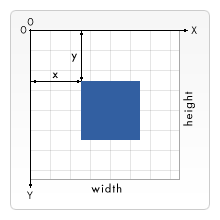
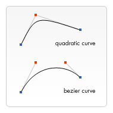

# 绘制形状

## 栅格

HTML模板中有个宽150px，高150px的canvas元素，`<canvas>` 元素默认被网格所覆盖。通常来说网格中的一个单元相当于 `<canvas>` 元素中的**一像素**，栅格的起点为左上角（坐标为（0,0））。

所有元素的位置都相对于原点定位。所以图中蓝色方形左上角的坐标为距离左边（X轴）x像素，距离上边（Y轴）y像素（坐标为（x,y））。




## 绘制矩形

不同于SVG，HTML中的元素 `<canvas>` 只支持一种原生的图形绘制：矩形。所有其他的图形的绘制都至少需要生成一条路径。

`<canvas>` 提供了三种方法绘制矩形的：

```js
// 绘制一个填充的矩形
fillRect(x, y, width, height);
// 绘制一个矩形的边框
strokeRect(x, y, width, height);
// 清除指定矩形区域，让清除部分完全透明。
clearRect(x, y, width, height);
```

| 展示 | 步骤 |
| --- | --- |
| <Canvas-Rect /> | ```1.  ctx.fillRect(25, 25, 100, 100)``` <br /> ```2. ctx.clearRect(45, 45, 60, 60)```<br /> ```3. ctx.strokeRect(50, 50, 50, 50)``` |

`fillRect()` 函数绘制了一个边长为100*100px的黑色正方块，`clearRect()` 函数从正方形的中心开始擦出一个60*60px的正方形，接着 `strokeRect()` 在清除区域内生产一个50*50px的正方形边框。


## 绘制路径

图形的基本元素都是路径。路径是通过不同的颜色和宽度的线段和曲线相连形成不同的形状的点的集合。一个路径，甚至一个子路径，都是闭合的。使用路径绘制图形需要一些额外的步骤。

1. 首先，需要创建路径起始点；
2. 然后使用画图命令去画出路径；
3. 之后把画出的路径封闭；
4. 一旦生成路径，就能通过描边或填充路径区域来渲染图形。

所用到的函数：

```js
// 新建一条路径，生成之后，图形绘制命令被指向到路径上生成路径。
beginPath();
// 闭合路径之后图形绘制命令又重新指向到上下文中。
closePath();
// 通过线条来绘制图形轮廓。
stroke();
// 通过填充路径的内容区域生成实心的图形。
fill();
```

| 展示 | 步骤 |
| --- | --- |
| <Canvas-Path /> | ``` 1. ctx.beginPath(); ``` <br /> ```2. ctx.moveTo(75, 50); ``` <br /> ``` 3. ctx.lineTo(100, 75);```<br /> ``` 4. ctx.lineTo(100, 25); ```<br />``` 5. ctx.fill();```|


### 移动笔触

`moveTo()` 一个非常有用的函数，这个函数实际上不能画出任何东西，也是上面所描述的路径列表的一部分。将画笔的的笔尖出一个点移动到另一个点的过程。

```js
// 将笔触移动到指定的坐标x以及y上
moveTo(x, y)
```

当 `<canvas>` 初始化或者 `beginPath()` 调用后，通常会使用 `moveTo()` 函数设置起点；也能够使用 `moveTo()` 绘制一些不连续的路径。

<Canvas-MoveTo />

```vue
<template>
  <div>
    <canvas id="canvasMoveTo" height="150" width="150"></canvas>
  </div>
</template>

<script>
  export default {
    mounted() {
      const canvas = document.getElementById('canvasMoveTo');
      if(canvas.getContext) {
        const ctx = canvas.getContext('2d');
        ctx.beginPath();
        ctx.arc(75, 75, 50, 0, Math.PI*2, true);
        ctx.moveTo(110, 75)
        ctx.arc(75, 75, 35, 0, Math.PI, false);
        ctx.moveTo(65, 65);
        ctx.arc(60, 65, 5, 0, Math.PI*2, true);  // 左眼
        ctx.moveTo(95, 65);
        ctx.arc(90, 65, 5, 0, Math.PI*2, true);  // 右眼
        ctx.stroke();
      }
    }
  }
</script>

<style lang="scss">

</style>
```


### 线

绘制直线，需要用到方法 `lineTo()`。

```js
// 绘制一条从当前位置到指定x以及y位置的直线
lineTo(x, y);
```

使用 `lineTo()` 绘制图形时，需要注意填充方式，使用 `fill()` 填充路径生成实心图形，不需要使用 `closePath()`，当使用 `stroke()` 绘制图形轮廓时，需要先使用 `closePath()` 闭合图形才可以。

<Canvas-LineTo />


```vue
<template>
  <div>
    <canvas id="canvasLineTo" width="150" height="150"></canvas>
  </div>
</template>

<script>
  export default {
    mounted() {
      const canvas = document.getElementById('canvasLineTo');
      if(canvas.getContext) {
        const ctx = canvas.getContext('2d');
        // 填充三角形
        ctx.beginPath();
        ctx.moveTo(25, 25);
        ctx.lineTo(105, 25);
        ctx.lineTo(25, 105);
        ctx.fill();

        // 描边三角形
        ctx.beginPath();
        ctx.moveTo(125, 125);
        ctx.lineTo(125, 45);
        ctx.lineTo(45, 125);
        ctx.closePath();
        ctx.stroke();
      }
    }
  }
</script>

<style lang="scss">

</style>
```


### 圆弧

绘制圆弧或者圆，使用 `arc()` 方法。当然可以使用 `arcTo()`，不过这个实现不可靠，不做讨论。

```js
/**
* x,y:            圆心所在位置
* radius:         半径
* startAngle:     开始位置
* endAngle:       结束位置
* anticlockwise   画圆方向（默认为顺时针）
* 
* arc函数中角的单位是弧度，不是角度——角度与弧度的js表达式:  弧度=(Math.PI/180)*角度
*/
arc(x, y, radius, startAngle, endAngle, anticlockwise)
```

<Canvas-Arc />

```vue
<template>
  <div>
    <canvas id="canvasArc" height="150" width="250"></canvas>
  </div>
</template>

<script>
  export default {
    mounted() {
      const canvas = document.getElementById('canvasArc');
      if(canvas.getContext) {
        const ctx = canvas.getContext('2d');

        ctx.beginPath();
        ctx.arc(50, 50, 50, 0, 2*Math.PI, false);
        ctx.fillStyle = 'rgba(255, 85, 45, 0.6)';
        ctx.fill();

        ctx.beginPath();
        ctx.arc(150, 50, 50, 0, 2*Math.PI, false);
        ctx.strokeStyle = 'rgba(85, 45, 255, 0.6)';
        ctx.stroke();
      }
    }
  }
</script>

<style lang="scss">

</style>
```

### 二次贝塞尔曲线及三次贝塞尔曲线

```js
// 绘制二次贝塞尔曲线，cp1x,cp1y为一个控制点，x,y为结束点。
quadraticCurveTo(cp1x, cp1y, x, y)
// 绘制三次贝塞尔曲线，cp1x,cp1y为控制点一，cp2x,cp2y为控制点二，x,y为结束点。 
bezierCurveTo(cp1x, cp1y, cp2x, cp2y, x, y)
```

 

上图能够很好的描述两者的关系，二次贝塞尔曲线有一个开始点（蓝色）、一个结束点（蓝色）以及一个控制点（红色），而三次贝塞尔曲线有两个控制点。 

### 矩形

直接在画布上绘制矩形的三个额外方法，`rect()` 方法，将一个矩形添加到当前路径上。
```js
// 绘制一个左上角坐标为（x,y），宽高为width以及height的矩形
rect(x, y, width, height);
```
当该方法执行的时候，`moveTo()` 方法自动设置坐标参数(0, 0)。也就是说，当前笔触自动重置回默认坐标。


## Path2D 对象

正如之前看到的，可以使用一系列的路径和绘图命令把对象"画"在画布上。为了简化代码和提高性能，Path2D对象已可以在较新版本的浏览器中使用，用来缓存或记录绘画命令，这样你将能快速地回顾路径。

怎么生成一个Path2D对象呢？

```js
/**
* Path2D()会返回一个新初始化的Path2D对象
* 可能将某一个路径作为变量——创建一个它的副本，或者将一个包含SVG path数据的字符串作为变量
*/

new Path2D();     // 空的Path对象
new Path2D(path); // 克隆Path对象
new Path2D(d);    // 从SVG建立Path对象
```

所有的路径方法比如moveTo, rect, arc或quadraticCurveTo等，如我们前面见过的，都可以在Path2D中使用。

Path2D API添加了addPath作为将path结合起来的方法。当你想要从几个元素中来创建对象时，这将会很实用。比如：`Path2D.addPath(path [, transform])`

<Canvas-Path2D />

```vue
<template>
  <div>
    <canvas id="canvasPath2D" width="150" height="100"></canvas>
  </div>
</template>

<script>
  export default {
    mounted() {
      const canvas = document.getElementById('canvasPath2D');
      if(canvas.getContext) {
        const ctx = canvas.getContext('2d');

        const rectangle = new Path2D();
        rectangle.rect(10, 10, 50, 50);

        const circle = new Path2D();
        circle.moveTo(125, 35);
        circle.arc(100, 35, 25, 0, 2 * Math.PI);

        ctx.stroke(rectangle);
        ctx.fill(circle);
      }
    }
  }
</script>

<style lang="scss">

</style>
```

### 使用 SVG paths

新的Path2D API有另一个强大的特点，就是使用SVG path data来初始化 `<canvas>` 上的路径

这将使你获取路径时可以以SVG或canvas的方式来重用它们：

```js
const p = new Path2D("M10 10 h 80 v 80 h -80 Z");
```
