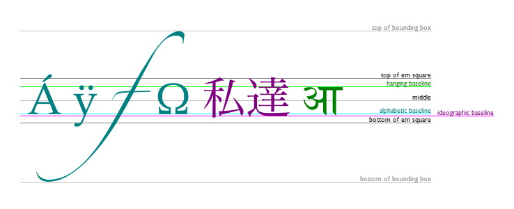

# 绘制文本

canvas提供两种方法来渲染文本：

```js

/**
* 绘制填充文本
* text    文本
* x,y     指定位置
*/
fillText(text, x, y, [, maxWidth]);

/**
* 绘制文本边框
* text    文本
* x,y     指定位置
*/
strokeText(text, x, y, [, maxWidth]);
```

<Canvas-Text />

```vue
<template>
  <div>
    <canvas id="canvasText" width="500" height="150"></canvas>
  </div>
</template>

<script>
  export default {
    mounted() {
      const ctx = document.getElementById('canvasText').getContext('2d');
      ctx.font = '48px serif';
      ctx.fillText('Hello world', 10, 50, 300);
      ctx.strokeText('Hello world', 10, 100, 300);
      ctx.font = '16px serif';
      ctx.fillText('填充文本', 300, 50);
      ctx.strokeText('绘制文本边框', 300, 100);
    }
  }
</script>

<style lang="scss">

</style>
```


## 有样式的文本

还有更多的属性可以让你改变canvas显示文本的方式：

```js
// 当前我们用来绘制文本的样式. 这个字符串使用和 CSS font 属性相同的语法。默认的字体是 10px sans-serif
font = value;

// 文本对齐选项. 可选的值包括：start, end, left, right or center。默认值是 start
textAlign = value

// 当前我们用来绘制文本的样式. 这个字符串使用和 CSS font 属性相同的语法。默认的字体是 10px sans-serif
textBaseline = value

// 文本方向。可能的值包括：ltr, rtl, inherit。默认值是 inherit
direction = value
```




## 预测量文本宽度

```measureText()```

将返回一个 TextMetrics对象的宽度、所在像素，这些体现文本特性的属性。

```js
const ctx = document.getElementById('canvas').getContext('2d');
const text = ctx.measureText("foo"); // TextMetrics object
text.width; // 16;
```
