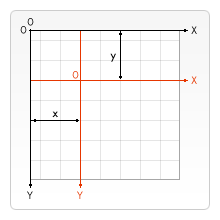

# 变形

变形是一种更强大的方法，可以将原点移动到另一点、对网格进行旋转和缩放。

## 状态的保存和恢复

绘制复杂图形时必不可少的两个方法：

```js
// 保存画布canvas的所有状态
save();

// 恢复画布canvas的状态
restore();
```

`save()` 和 `restore()` 方法是用来保存和恢复canvas状态的，都没有参数。canvas的状态就是当前画面应用的所有样式和变形的一个快照。

canvas状态存储在栈中，每当 `save()` 方法被调用后，当前的状态就被推送到栈中保存。一个绘画状态包括：

- 当前应用的变形；
- strokeStyle, fillStyle, globalAlpha, lineWidth, lineCap, lineJoin, miterLimit, shadowOffsetX, shadowOffsetY, shadowBlur, shadowColor, globalCompositeOperation 的值；
- 当前的裁切路径（clipping path）。

:::tip
可以调用任意次 `save()` 方法，每一次调用 `restore()` 方法，上一个保存的状态就从栈中弹出，所有设定都恢复。
:::

<Canvas-SaveAndRestore />

```vue
<template>
  <div>
    <canvas id="canvasSaveAndRestore" height="150" width="150"></canvas>
  </div>
</template>

<script>
  export default {
     mounted() {
       const ctx = document.getElementById('canvasSaveAndRestore').getContext('2d');
  
       ctx.fillRect(0, 0, 150, 150);
       ctx.save();     // 保存默认状态
  
       ctx.fillStyle = '#09F';
       ctx.fillRect(15, 15, 120, 120);
       ctx.save();     // 保存当前状态
  
       ctx.fillStyle = 'rgba(255, 255, 255, .5)';
       ctx.fillRect(30, 30, 90, 90);
  
       ctx.restore();  // 重新加载之前的颜色状态
       ctx.fillRect(45, 45, 60, 60);
  
       ctx.restore();  // 加载默认颜色配置
       ctx.fillRect(60, 60, 30, 30)
     }
  }
</script>

<style lang="scss">

</style>
```


## 移动 Translating

先介绍 `translate()` 方法，它用来移动canvas和它的原点到一个不同的位置。

```js
/**
* x,y     x是左右偏移量，y是上下偏移量
*/
translate(x, y)
```


在做变形之前先保存状态是一个良好的习惯。大多数情况下，调用 `restore()` 方法比手动恢复原先的状态要简单得多。

<Canvas-Translate />

```vue
<template>
  <div>
    <canvas id="canvasTranslate" width="150" height="150"></canvas>
  </div>
</template>

<script>
  export default {
    mounted() {
      const ctx = document.getElementById('canvasTranslate').getContext('2d');
      for (let i = 0; i < 3; i++) {
        for (let j = 0; j < 3; j++) {
          ctx.save();
          ctx.fillStyle = `rgba(${51*i}, ${255-51*i}, 255)`;
          ctx.translate(10+j*50, 10+i*50);
          ctx.fillRect(0, 0, 25, 25);
          ctx.restore();
        }
      }
    }
  }
</script>

<style lang="scss">

</style>
```


## 旋转 Rotating

第二个介绍 `rotate()` 方法它用于以原点为中心选择canvas。

```js
/**
* angle     旋转的角度(angle)，它是顺时针方向的，以弧度为单位的值。
*/
rotate(angle);
```

旋转中心始终是canvas的原点，如果要改变它，需要使用 `translate()` 方法。

<Canvas-Rotate />

```vue
<template>
  <div>
    <canvas id="canvasRotate" width="150" height="150"></canvas>
  </div>
</template>

<script>
  export default {
    mounted() {
      const ctx = document.getElementById('canvasRotate').getContext('2d');

      ctx.translate(75, 75);

      for (let i = 0; i < 6; i++) {
        ctx.save();
        ctx.fillStyle = `rgb(${51*i}, ${255-51*i}, 255)`;
        for (let j = 0, max = i*6; j < max; j++) {
          ctx.rotate(Math.PI*2/(i*6));
          ctx.beginPath();
          ctx.arc(0, i*12.5, 5, 0, Math.PI*2, true);
          ctx.fill();
        }
        ctx.restore();
      }
    }
  }
</script>

<style lang="scss">

</style>
```


## 缩放 Scaling

缩放，用它来增减图形在canvas中的像素数目，对形状，位图进行缩小或者放大。

```js
/**
* x       水平缩放因子
* y       垂直缩放因子
* x,y     如果为负实数，相当于以x轴或y轴作为对称性镜像反转
*/
scale(x, y);
```

<Canvas-Scale />

```vue
<template>
  <div>
    <canvas id="canvasScale" width="150" height="150"></canvas>
  </div>
</template>

<script>
  export default {
    mounted() {
      const ctx = document.getElementById('canvasScale').getContext('2d');
      ctx.save();
      ctx.scale(10, 3);
      ctx.fillRect(1, 10, 10, 10);
      ctx.restore();

      ctx.scale(-1, 1);
      ctx.font = '48px serif';
      ctx.fillText('MDN', -135, 120);
    }
  }
</script>

<style lang="scss">

</style>
```

## 变形 Transforms

略过
