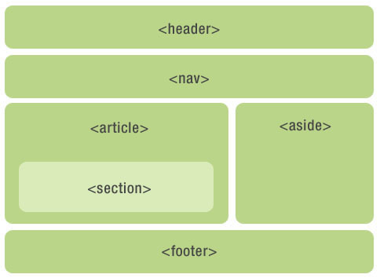

# HTML语义化

## 什么是语义化？

首先，语义化，就是写的HTML结构，是用相对应的有一定语义的英文字母（标签）表示的，因为HTML本身就是**标记语言**。

> 【问】怎么知道，自己的页面是否语义化？
> 
> 【答】当HTML结构在去掉CSS样式后，还能够很好的呈现内容的结构，代码结构。

其实语义化，也无非就是在使用标签的时候多使用有英文语义的标签，比如 `<h1>` 标签，在HTML中用来定义标题；`
` 标签，英文是paragraph段落，`<table>` 表格标签，等等。
                             
::: tip
**为什么要语义化？**

- 为了在没有CSS的情况下，页面也能呈现出很好的内容结构、代码结构；

- 提升用户体验，例如title、alt用于解释名词或解析图片信息的标签尽量填写有含义的词语、`<label>` 标签的活用；

- 有利于SEO，和搜索引擎建立良好的沟通，有助于爬虫抓取更多的有效信息，爬虫依赖于标签来确定上下文和各个关键字的权重；

- 方便其他设备（如屏幕阅读器、盲人阅读器、移动设备）以有意义的方式来渲染网页；

- 便于团队开发和维护，语义化更具有可读性，可以减少差异性。
:::

## 写HTML标签时，应该注意什么？

- 尽可能少用无语义的标签 `
` 和 ``；

- 在语义不明显时，既可以是 `
` 或者 `
` 时，尽量使用 `
`，因为 `
` 在默认的情况下有上下间距，对兼容特殊终端有利；

- 不要使用纯样式标签，如：b、font、u等，改用css设置；

- 需要强调的文本，可以包含在 `<strong>` 和 `<em>` 标签中，`<strong>` 默认样式是加粗（不要用 `<b>`），`<em>` 是斜体（不要用 `<i>`）;

- 使用表格时，标签要用 `<caption>`，表头用 `<thead>`，主要部分用 `<tbody>` 包围，尾部用 `<tfoot>` 包围。表头和一般的单元格要区分开，表头用 `<th>`，单元格用 `<td>`；

- 表单域用于 `<fieldset>` 标签包起来，并用 `<legend>` 标签说明表单的用途；

- 每个 `<input>` 标签对应的说明文本都需要使用 `<label>` 标签，并且通过 `<input>` 设置 `id` 属性，在 `<label>` 标签中设置 `for=someId` 来让说明文本和相对应的 `<input>` 关联起来。
                                           
- 不仅写html结构时，要用语义化标签，给元素写css类名时，也是遵循语义化原则

## HTML5新增了那些语义化标签？

### header元素
`<header>` 元素代表网页和 `<section>` 的页眉。通常包含 `<h1>`~`<h6>` 元素或者 `<hgroup>` 元素，作为整个页面或者内容块的标题；也可以包裹一节的目录部分，一个搜索框，一个 `<nav>`，或者任何的logo；整个页面没有限制 `<header>` 元素的个数，可以拥有多个，也可以为每个内容块增加一个 `<header>` 元素。

**header使用注意：**
* 可以是网页或任意 `<section>` 的头部部分；
* 没有个数限制；
* 如果 `<hgroup>` 或者 `<h1>`~`<h6>` 就能工作的很好，那就不要用 `<header>`。

### footer元素
`<footer>` 元素代表网页和 `<section>` 的页脚，通常含有该页面的一些基础信息，例如：文档创作者的名字、文档的版权信息、使用条款的链接、联系信息等。

**footer使用注意：**
* 可以是网页或者任意部分 `<section>` 的底部部分；
* 没有个数限制，除了包裹的内容不一样，其他跟 `<header>` 类似。

### hgroup元素
`<hgroup>` 元素代表网页和 `<section>` 的标题，当元素有多个层级时，该元素可以将 `<h1>`~`<h6>` 用 `<hgroup>` 包住，和其他文章元素一起放入 `<header>` 标签，例如文章的主标题和副标题的组合；

**hgroup使用注意：**
* 如果只需要一个 `<h1>`~`<h6>` 标签就不需要用 `<hgroup>`；
* 如果有连续多个 `<h1>`~`<h6>` 标签就用 `<hgroup>`；
* 如果有连续多个标题和其他文章数据，`<h1>`~`<h6>`标签就用 `<hgroup>` 包住，和其他文章数据一起放入 `<header>` 标签。

### nav元素
`<nav>` 元素代表页面的导航链接区域。用于定义页面的主要导航；

**nav使用注意：**
* 用在整个页面主要导航部分上，不合适就不要用 `<nav>` 元素。

### aside元素
`<aside>` 元素被包含在 `<article>` 元素中作为主要内容的附属信息，其中内容可以是当前文章有关的相关材料、标签、名词解释（特殊的 `<section>`）；在 `<article>` 元素之外使用作为页面或站点全局的附属信息部分，最典型的是侧边栏，其中的内容可以是日志串连，其他组的导航，甚至广告，这些内容相关的页面。

**aside使用注意：**
* `<aside>` 在 `<article>` 内表示主要内容的附属信息；
* 在 `<article>` 之外可以做侧边栏，没有 `<article>` 与之对应，最好别用；
* 如果是广告，其他日志链接或者其他类导航也可以用。

### section元素
元素代表文档中的“节”或“段”，“段”可以是一篇文章里按照主题的分段；“节”可以是指一个页面里的分组。

**section使用注意：**
* 一张页面可以用 `<section>` 划分简介、文字条目和联系信息。不过在文章内页，最好用 `<article>`；
* `<section>` 不是一般意义上的容器元素，如果想作为样式展示和脚本的便利，可以用 `
`；
* `<article>`、`<nav>`、`<aside>` 可以理解为特殊的 `<section>`，所以如果可以用 `<article>`、`<nav>`、`<aside>` 就不要用 `<section>`，没实际意义的就用 `
`。

### article元素
`<article>` 元素最容易跟 `<section>` 和 `
` 混淆，其中 `<article>` 代表一个在文档，页面或者网站中自成一体的内容其目的为了让开发者独立开发或重用。例如论坛的帖子，博客上的文章，一篇用户的评论，一个互动的widget小工具（特殊的 `<section>`）；除了它的内容，`<article>` 会有一个标题（通常会在 `<header>` 里），会有一个 `<footer>` 页脚；

**article使用注意：**
* 自身独立的情况下：用 `<article>`
* 是相关内容：用 `<section>`
* 没有语义的：用 `
`

