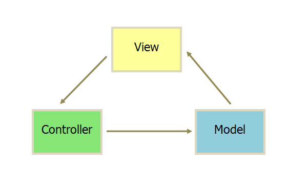
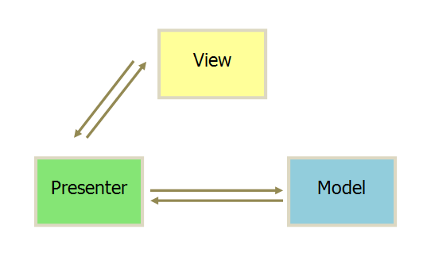
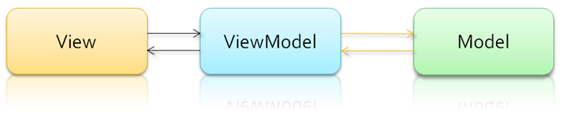

# MV*设计技巧

## MVC设计模式

### MVC概念

- MVC设计模式是一种常用的软件架构方式，以Controller，Model，View三个模块分离的形式来组织代码。
- MVC的核心思想（本质）是业务数据抽取同业务数据呈现分离。

### MVC分层

MVC模式代表Model-View-Controller（模式-视图-控制器）模式。这种模式用于程序的分层开发。

- Model（模型）- 模型层，业务数据的信息表示，关注支持业务的信息构成，通常是多个业务实体的组合。
- View（视图）- 视图层，为用户提供 UI 重点关注数据的呈现。
- Controller（控制器）- 控制层，调用业务逻辑产生合适的数据（Model），传递数据给视图层用于呈现。

### MVC基本流程

控制层接受客户端的请求，调用模型层生成业务数据，传递给视图层，将最终的业务数据和视图响应给客户端做展示

### MVC优点

- 各层的耦合度低
- 可重用性高
- 可维护性高
- 部署快，生命周期短

### MVC缺点

- 没有明确的定义
- 不适合小型，中等规模的应用程序
- 增加系统结构和实现的复杂性
- 视图与控制器间的过于紧密的连接
- 视图对模型数据的低效率访问
- 一般高级的界面工具或构造器不支持模式

## MVP设计模式

### MVP分层

- Model（模型）- 模型层，数据保存。
- View（视图）- 视图层，用户界面。
- Presenter（控制器）- 控制层，呈现。

### MVP优点

- 模型与视图完全分离，我们可以修改视图而不影响模型。
- 可以更高效地使用模型，因为所有的交互都发生在一个地方——Presenter内部。
- 我们可以将一个Presenter用于多个视图，而不需要改变Presenter的逻辑。
- 如果我们把逻辑放在Presenter中，那么我们就可以脱离用户接口来测试这些逻辑（单元测试）。

### MVP缺点

由于对视图的渲染放在了Presenter中，所以视图和Presenter的交互会过于频繁。还有一点需要明白，如果Presenter过多地渲染了视图，往往会使得它与特定的视图的联系过于紧密。

一旦视图需要变更，那么Presenter也需要变更了。

### MVP和MVC的区别

作为一个新模式，MVP与MVC有着一个重大的区别：在MVP中View并不直接使用Model，它们之间的通信是通过Presenter (MVC中的Controller)来进行的。

所有的交互都发生在Presenter内部，而在MVC中View会直接从Model中读取数据而不是通过Controller。

在MVC里，View是可以直接访问Model的！从而，View里会包含Model信息，不可避免的还要包括一些业务逻辑。

在MVC模型里，更关注的Model的改变，所以，在MVC模型里，Model不依赖于View，但是View是依赖于Model的。

虽然MVC中的View的确“可以”访问Model，但是我们不建议在View中依赖Model，而是要求尽可能把所有业务逻辑都放在Controller中处理，而View只和Controller交互。

## MVVM设计模型 <Badge text="推荐"/>

### MVVM概念

如今主流的web框架基本采用的是MVVM模式，为什么放弃MVC模式，转而投向了MVVM模式呢。在之前的MVC中我们提到一个控制器对应一个视图，控制器用状态机进行管理，这里就存在一个问题，如果项目足够大的时候，状态机的代码量就变得非常臃肿，难以维护。

还有一个就是性能问题，在MVC中我们大量操作了DOM，而大量操作DOM会让页面渲染性能降低，加载速度变慢，影响用户体验。

最好就是当Model频繁变化的时候，开发者就主动更新View，那么数据的维护就变得困难。

这个时候，MVVM模式在前端中应用就应运而生。MVVM让用户界面和逻辑分离更加清晰。

### MVVM模式的组成部分

- Model（模型）：模型是指代真实状态内容的领域模型——面向对象，或指代内容的数据访问层，以数据为中心。
- View（视图）：就像在MVC和MVP模型中一样，视图是用户在屏幕上看到的结构、布局和外观UI。
- viewModel（视图模型）：视图模型是暴露公共属性和命令的视图的抽象，MVVM没有MVC模型的控制器，也没有MVP模型的Presenter，有的是一个绑定器（`绑定器：声明性数据和命令绑定隐含在MVVM模式中`）。在视图模型中，绑定器在视图和数据绑定器之间进行通信。

### MVVM优点

MVVM模式和MVC模式一样，主要目的是分离视图（View）和模型（Model），有几大优点

- 低耦合
- 可重用性
- 独立开发
- 可测试

### MVVM与MVP区别

MVVM模式将Presener改名为View Model，基本上与MVP模式完全一致，唯一的区别是，它采用双向绑定 (data-binding)，View的变动，自动反映在View Model，反之亦然。这样开发者就不用处理接收事件和View更新的工作，框架已经帮你做好了。

## 总结 <Badge text="演变"/>

这些模式是依次进化而形成**MVC—>MVP—>MVVM**。在以前传统的开发模式当中即MVC模式，前端人员只负责：Model（数据库）、View（视图）、Controller/Presenter/ViewModel（控制器）当中的View（视图）部分，写好页面交由后端创建渲染模板并提供数据。

随着MVP/MVVM模式的出现前端已经可以自己写业务逻辑以及渲染模板，后端只负责提供数据即可。
