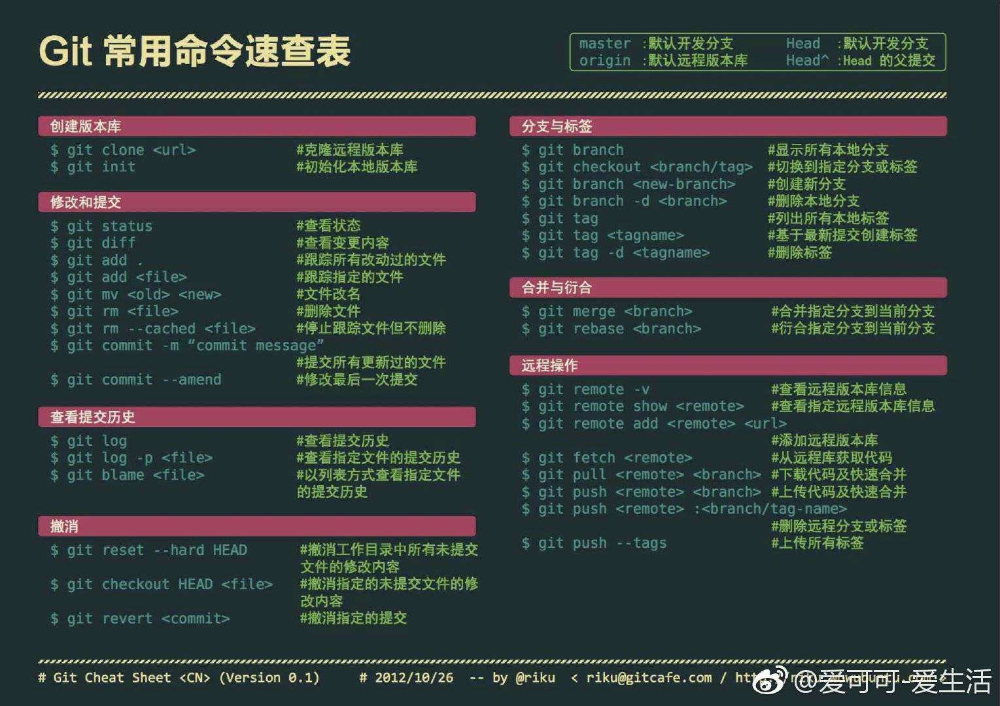

# Git 指令



## 创建版本库

```
# --- git clone ---

# 默认在当前目录下创建和版本库名相同的文件夹并下载版本到该文件夹下
$ git clone <远程仓库的网址>

# 指定本地仓库的目录
$ git clone <远程仓库的网址> <本地目录>

# -b 指定要克隆的分支，默认是master分支
$ git clone <远程仓库的网址> -b <分支名称> <本地目录>
```

```
# --- git init ---

# 初始化本地仓库，在当前目录下生成 .git 文件夹
$ git init
```

## 修改和提交

```
# --- git status ---

# 查看本地仓库的状态
$ git status

# 以简短模式查看本地仓库的状态
# 会显示两列，第一列是文件的状态，第二列是对应的文件
# 文件状态：A 新增，M 修改，D 删除，?? 未添加到Git中
$ git status -s
```

```
# --- git diff ---

# 比较当前文件和暂存区中文件的差异，显示没有暂存起来的更改
$ git diff

# 比较暂存区中的文件和上次提交时的差异
$ git diff --cached
$ git diff --staged

# 比较当前文件和上次提交时的差异
$ git diff HEAD

# 查看从指定的版本之后改动的内容
$ git diff <commit ID>

# 比较两个分支之间的差异
$ git diff <分支名称> <分支名称>

# 查看两个分支分开后各自的改动内容
$ git diff <分支名称>...<分支名称>
```

```
# --- git add ---

# 添加所有修改、已删除、新增的文件到暂存区中
$ git add .

# 把指定的文件添加到暂存区中
$ git add <文件路径>

# 添加所有修改、已删除的文件到暂存区中
$ git add -u [<文件路径>]
$ git add --update [<文件路径>]

# 添加所有修改、已删除、新增的文件到暂存区中，省略 <文件路径> 即为当前目录
$ git add -A [<文件路径>]
$ git add --all [<文件路径>]

# 查看所有修改、已删除但没有提交的文件，进入一个子命令系统
$ git add -i [<文件路径>]
$ git add --interactive [<文件路径>]
```

```
# --- git mv ---

# 重命名指定的文件或者文件夹
# <源文件/文件夹> => <目标文件/文件夹>
$ git mv <源文件/文件夹> <目标文件/文件夹>
```

```
# --- git rm ---

# 移除跟踪指定的文件，并从本地仓库的文件夹中删除
$ git rm <文件路径>

# 移除跟踪指定的文件夹，并从本地仓库的文件夹中删除
$ git rm -r <文件夹路径>

# 移除跟踪指定的文件，在本地仓库的文件夹中保留该文件
$ git rm --cached
```

```
#--- git commit ---

# 把暂存区中的文件提交到本地仓库，调用文本编辑器输入该次提交的描述信息
$ git commit

# 把暂存区中的文件提交到本地仓库中并添加描述信息
$ git commit -m "<提交的描述信息>"

# 把所有修改、已删除的文件提交到本地仓库中
# 不包括未被版本库跟踪的文件，等同于先调用了 "git add -u"
$ git commit -a -m "<提交的描述信息>"

# 修改上次提交的描述信息
$ git commit --amend
```

## 查看提交历史

```
# --- git log ---

# 打印所有的提交记录
$ git log

# 打印从第一次提交到指定的提交的记录
$ git log <commit ID>

# 打印指定数量的最新提交的记录
$ git log -<指定的数量> 
```

## 撤销

```
# --- git reset ---

# 将 HEAD 的指向改变，撤销到指定的提交记录，文件也修改了
$ git reset --hard <commit ID>

```

```
# --- git revert ---

# 生成一个新的提交来撤销某次提交，此次提交之前的所有提交都会被保留。
$ git revert <commit ID>
```

## 分支与标签

```
# --- git branch ---

# 列出本地的所有分支，当前所在分支以 "*" 标出
$ git branch

# 列出本地的所有分支并显示最后一次提交，当前所在分支以 "*" 标出
$ git branch -v

# 创建新分支，新的分支基于上一次提交建立
$ git branch <分支名>

# 修改分支名称
# 如果不指定原分支名称则为当前所在分支
$ git branch -m [<原分支名称>] <新的分支名称>
# 强制修改分支名称
$ git branch -M [<原分支名称>] <新的分支名称>

# 删除指定的本地分支
$ git branch -d <分支名称>

# 强制删除指定的本地分支
$ git branch -D <分支名称>
```

```
# --- git checkout ---

# 切换到已存在的指定分支
$ git checkout <分支名称>

# 创建并切换到指定的分支，保留所有的提交记录
# 等同于 "git branch" 和 "git checkout" 两个命令合并
$ git checkout -b <分支名称>

# 创建并切换到指定的分支，删除所有的提交记录
$ git checkout --orphan <分支名称>

# 替换掉本地的改动，新增的文件和已经添加到暂存区的内容不受影响
$ git checkout <文件路径>
```

```
# --- git tag ---

# 打印所有的标签
$ git tag

# 添加轻量标签，指向提交对象的引用，可以指定之前的提交记录
$ git tag <标签名称> [<commit ID>]

# 添加带有描述信息的附注标签，可以指定之前的提交记录
$ git tag -a <标签名称> -m <标签描述信息> [<commit ID>]

# 切换到指定的标签
$ git checkout <标签名称>

# 查看标签的信息
$ git show <标签名称>

# 删除指定的标签
$ git tag -d <标签名称>

# 将指定的标签提交到远程仓库
$ git push <远程仓库的别名> <标签名称>

# 将本地所有的标签全部提交到远程仓库
$ git push <远程仓库的别名> –tags
```

## 合并与衍合

```
# --- git merge ---

# 合并指定分支到当前分支
$ git merge <分支名称>
```

```
# --- git rebase ---

# 衍合指定分支到当前分支
$ git rebase <分支名称>
```

## 远程操作

```
# --- git remote ---

# 列出已经存在的远程仓库
$ git remote

# 列出远程仓库的详细信息，在别名后面列出URL地址
$ git remote -v
$ git remote --verbose

# 添加远程仓库
$ git remote add <远程仓库的别名> <远程仓库的URL地址>

# 修改远程仓库的别名
$ git remote rename <原远程仓库的别名> <新的别名>

# 删除指定名称的远程仓库
$ git remote remove <远程仓库的别名>

# 修改远程仓库的 URL 地址
$ git remote set-url <远程仓库的别名> <新的远程仓库URL地址>
```

```
# --- git fetch ---

# 将远程仓库所有分支的最新版本全部取回到本地
$ git fetch <远程仓库的别名>

# 将远程仓库指定分支的最新版本取回到本地
$ git fetch <远程主机名> <分支名>
```

```
# --- git pull ---

# 从远程仓库获取最新版本。
$ git pull
```

```
# --- git push ---

# 把本地仓库的分支推送到远程仓库的指定分支
$ git push <远程仓库的别名> <本地分支名>:<远程分支名>

# 删除指定的远程仓库的分支
$ git push <远程仓库的别名> :<远程分支名>
$ git push <远程仓库的别名> --delete <远程分支名>
```
