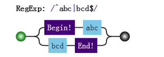

# 表达式的拆分

## 结构和操作符

编程语言一般都有操作符。只要有操作符，就会出现一些问题。当一大堆操作符在一起，先操作谁，后操作谁？了不产生歧义，就需要语言本身定义好操作顺序，即所谓的优先级。

而在正则表达式中，操作符都体现在结构中，即由特殊字符和普通字符所代表的一个个特殊整体。

> JS正则表达式中，都有那些结构呢？
> 
> 字符字面量、字符组、量词、锚字符、分组、选择分支、反向引用。

## 具体含义简要

* 字面量：匹配一个具体字符，包括不用转义的和需要转义的。比如 a 匹配字符 "a"，又比如 `\n` 匹配换行符，又比如 `\.` 匹配小数点。
* 字符组：匹配一个字符，可以是多种可能之一，比如 `[0-9]`，表示匹配一个数字。也有 `\d` 的简写形式。另外还有转义字符组，表示可以是除特定字符之外任何一个字符，比如 `[^0-9]`，表示一个非数字字符，也有 `\D` 的简写形式。
* 量词：表示一个字符连续出现，比如 `a{1,3}` 表示 "a" 字符连续出现3次。另外还有常见的简写形式，比如 `a+` 表示 "a" 字符连续出现至少一次。
* 锚点：匹配一个位置，而不是字符。比如 `^` 匹配字符串的开头，又比如 `\b` 匹配单词边界，又比如 `(?=\d)` 表示数字前面的位置。
* 分组：括号表示一个整体，比如 `(ab)+`，表示 "ab" 两个字符连续出现多次，也可以使用非捕获分组 `(?:ab)+`。
* 分支：多个子表达式多选一，比如 `abc|bcd`，表达式匹配 "abc" 或 "bcd" 字符子串。
* 反向引用：比如 `\2`，表示引用第2个分组。

## 涉及到的操作符

* 转义符 `\`
* 括号和方括号 `(...)`，`(?...)`，`(?=...)`，`(?!...)`，`[...]`
* 量词限定符 `{m}`，`{m,n}`，`{m,}`，`?`，`*`，`+`
* 位置和顺序 `^`，`$`，`\元字符`，一般字符
* 管道符 (竖杆) |

分析一个正则表达式：

```js
/**
* 由于括号的存在，所以，(c|de*)是一个整体结构。
* 在(c|de*)中，注意其中的量词*，因此e*是一个整体结构。
* 又因为分支结构"|"优先级最低，因此c是一个整体，而de*是另一个整体。
* 同理，整个正则分成了a、b?、()+、f、g。而又由于分支的原因，又可以分成ab?(c|de*)+和fg这两部分。
*/
const regex = /ab?(c|de*)+|fg/;
```

## 匹配字符串整体问题

因为是要匹配整个字符串，经常会在正则前后中加上锚字符串 `^` 和 `$`。

比如要匹配目标字符串 'abc' 或者 'bcd' 时，如果一不小心，就会写成 `/^abc|bcd$/`。

而位置字符和字符序列优先级要比竖杠高，故其匹配的结构是：



应该修改成：

```js
const regex = /^(abc|bcd)$/;
```

## 量词连缀问题

假设，要匹配这样的字符串：
* 每个字符为a、b、c任选其一
* 字符串的长度是3的倍数

此时正则不能写成 `/^[abc]{3}+$/`，这样会报错，说+前面没什么可重复的。

此时要修改成：

```js
const regex = /^([abc]{3})+$/;
```
