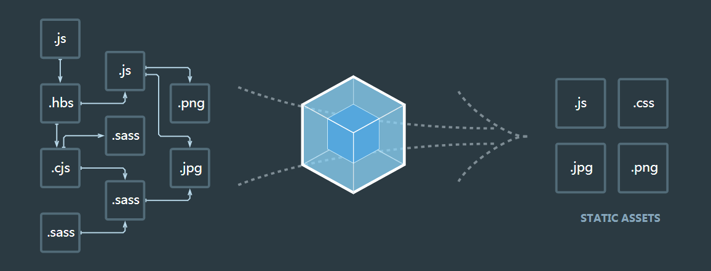

# webpack 介绍



### 编写代码

```js
// src/bar.js

export default function bar() {
 
}
```

```js
// src/index.js

import bar from './bar';

bar();
```

### 使用 webpack 打包

```js
// webpack.config.js

const path = require('path');

module.exports = {
  entry: './src/index.js',
  output: {
    path: path.resolve(__dirname, 'dist'),
    filename: 'bundle.js'
  }
}
```

```html
<!--page.html-->
<!doctype html>
<html>
  <head>
    <!-- 头部 -->
  </head>
  <body>
    <!-- 内容 -->
    <script src="dist/bundle.js"></script>
  </body>
</html>
```


